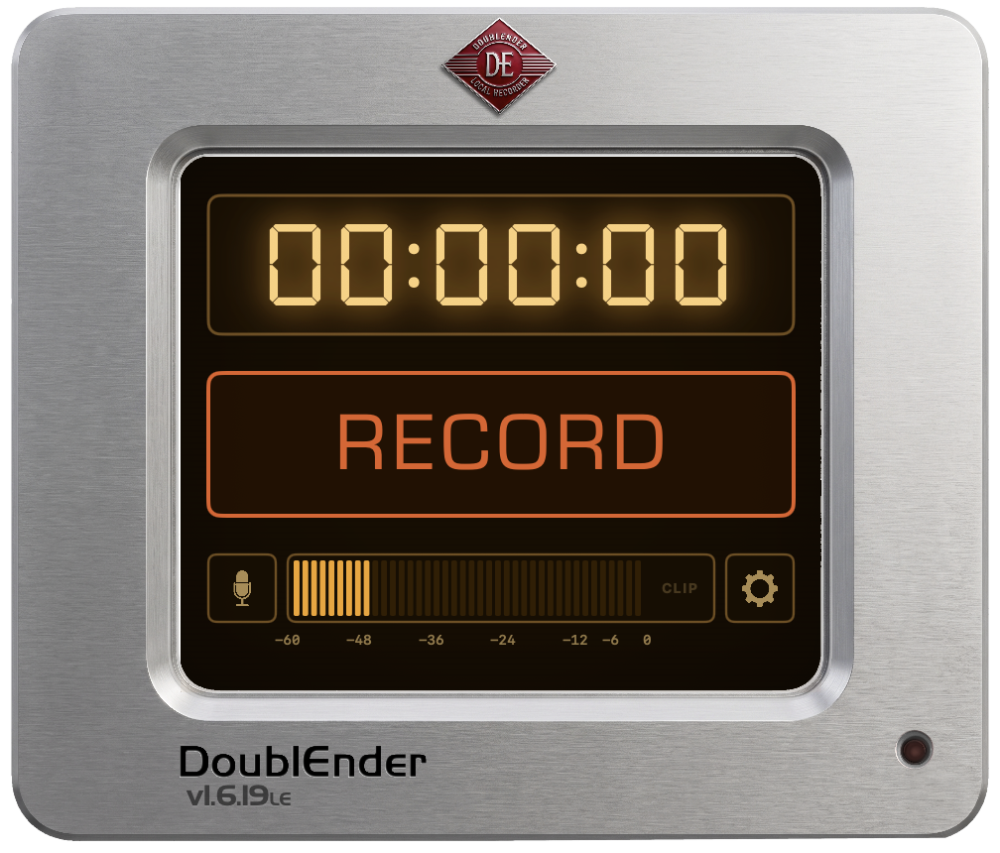
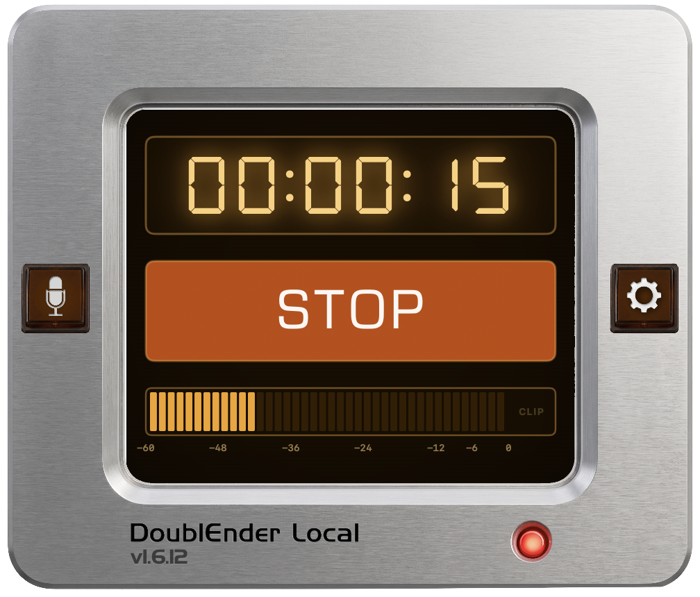

# DoublEnder
### Minimal macOS Audio Recorder

<p align="center">
  <strong>Dead-simple guest recording for podcasters</strong>
  <br />
  <strong>Version:</strong> 1.6.34lr
  <br />
  <a href="https://github.com/sevmorris/DoublEnder/releases/latest/download/DoublEnder-v1.6.34lr.dmg"><strong>Download Latest (DMG)</strong></a>
  ·
  <a href="https://sevmorris.github.io/DoublEnder/">App Page</a>
</p>

> **No installer needed.** DoublEnder is a self-contained app — just double-click it wherever it is: your Desktop, Downloads folder, an external drive, or anywhere else you like.

Pick your microphone, hit the button, get an AAC file on your Desktop. That's it.

<p align="center">
  
  
</p>

Designed for podcast guests who shouldn't need to know anything about audio. No setup, no account, no cloud. You send them the app; they record their side of the conversation and send you the file.

---

## Features

- **One-button recording** to AAC (M4A, 256 kbps) or WAV (24-bit PCM), mono at 48 kHz
- **Settings popover** (gear icon) — override the filename prefix, attach notes (written as file description metadata), or switch output format
- **Input selector** — pick any system audio input from the mic dropdown
- **Level meter** — lights up when audio is coming in so you know the mic is working (decorative; no gain control in the app)
- **No DSP processing** — what the mic captures is what hits the file (apart from the unavoidable AAC encode if you pick m4a)
- **LCD-style timer** — seven-segment HH:MM:SS readout with visible ghost segments
- **Save confirmation** — when a recording finishes, a confirmation dialog shows the saved filename (always visible, even if notifications are off)
- **Native notifications** — if enabled in System Settings, a banner also appears with a Reveal in Finder action
- **Quit protection** — ⌘Q during a recording prompts to save or discard before terminating
- **Crash recovery** — if the app exits unexpectedly mid-record, the next launch offers to keep or delete the orphaned file
- **Update checker** — Check for Updates… in the app menu polls GitHub releases for new versions

**Output:** `DoublEnder_<timestamp>.m4a` saved to your Desktop (or `.wav` if WAV is selected — 24-bit PCM, mono at 48 kHz). The filename prefix is overridable from the settings popover.

---

## Operational Specifications

- **Environment:** macOS 14.0+ (Sonoma); Apple Silicon and Intel
- **Output Format:** AAC/M4A (256 kbps) or WAV (24-bit PCM), mono
- **Dependencies:** None — fully self-contained

## Building from Source

```bash
git clone https://github.com/sevmorris/DoublEnder.git
cd DoublEnder
open DoublEnder.xcodeproj
```

Or from the command line:

```bash
xcodebuild -project DoublEnder.xcodeproj -scheme DoublEnder -configuration Release
```

The project is generated from `project.yml` via [XcodeGen](https://github.com/yonaskolb/XcodeGen) — if you edit `project.yml`, run `xcodegen generate` to regenerate the Xcode project.

## Technical Origin
I designed the recording workflow and UI. The Swift implementation was built with AI assistance. The app deliberately does no DSP — what the mic captures is what hits the file (apart from the unavoidable AAC encode when recording M4A).

---

### Support
If DoublEnder saves you time, [buy me a coffee](https://ko-fi.com/sevmo). Free forever either way.

### License
Copyright © 2026 Seven Morris.
Distributed under the [MIT License](LICENSE).

Bundled font: [DSEG7 Classic](https://github.com/keshikan/DSEG) by keshikan, licensed under the SIL Open Font License 1.1.
