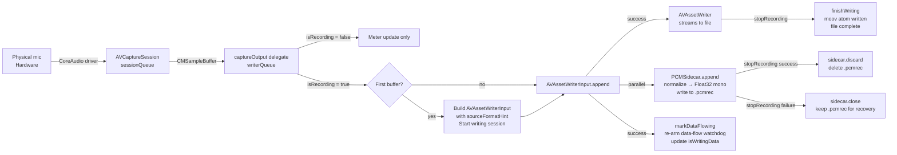

# DoublEnder — Theory of Operation

**Version:** 1.7.4lr · Last updated: 2026-06-07

---

## Table of Contents

1. [Product Overview](#1-product-overview)
2. [Architecture Overview](#2-architecture-overview)
3. [Audio Capture Pipeline](#3-audio-capture-pipeline)
4. [The State Machine](#4-the-state-machine)
5. [Robustness Architecture](#5-robustness-architecture)
6. [Device Management and Hot-Plug](#6-device-management-and-hot-plug)
7. [Crash Recovery in Detail](#7-crash-recovery-in-detail)
8. [Cloud Variant — What's Added](#8-cloud-variant--whats-added)
9. [App Lifecycle and Release Model](#9-app-lifecycle-and-release-model)
10. [Known Constraints and Design Decisions](#10-known-constraints-and-design-decisions)

---

## 1. Product Overview

### What the name means

A "double-ender" is a standard remote podcast recording technique. The host and guest each record their own microphone locally, then a producer combines the two independent recordings in post. This eliminates the compression artifacts and latency of a live stream capture and gives the editor full-quality stems from both sides. DoublEnder is the guest's end of that equation — the host typically uses professional DAW software; the guest needs something that can't be misconfigured.

### Who it's for and what problem it solves

DoublEnder is for podcast guests who should not need to know anything about audio. The problem is that most recording software is either consumer-grade and unpredictable (Voice Memos records in 32 kbps AAC over AirDrop; QuickTime loses the file if the window is closed mid-recording) or professional and intimidating. DoublEnder occupies the gap: it produces production-usable files, survives crashes and device disconnects, and presents nothing but a microphone picker and a single button.

The design philosophy is deliberately Voice Memos-like in UX simplicity and field-recorder-like in reliability. It is closer to a hardware recorder (Zoom H6, Sound Devices MixPre) than to a consumer screen recorder: it records continuously to a safe format, mirrors a crash-recovery copy in parallel, and never silently loses a take.

### The three variants

All three share 100% of the Swift source in `DoublEnder/`. They differ only in what's compiled in and what assets/credentials are bundled.

| Variant | Version suffix | Key addition | Distribution |
|---|---|---|---|
| **DoublEnder Local** | `lr` | — | GitHub releases + GCS permalink |
| **DoublEnder Cloud** | `cr` | GCS upload (Uploader, CloudConnectivity, CloudContentView, `GCS_ENABLED` flag) | GCS (private) |
| **Branded** (e.g. Hacks on Tap) | e.g. `ht` | Per-client faceplate, bundle ID, update channel, optional pre-recording name prompt | GCS (private, per-brand path) |

The `GCS_ENABLED` Swift compilation condition gates every Cloud-only code path. Every `#if GCS_ENABLED` block in the shared source tree compiles to nothing in Local builds, so the service-account key and upload logic are never shipped in the public app.

---

## 2. Architecture Overview

### Component map

```
┌─────────────────────────────────────────────────────────────┐
│                     DoublEnderApp (AppDelegate)              │
│  window chrome · quit intercept · crash recovery scan       │
└───────────────────────────┬─────────────────────────────────┘
                            │ @NSApplicationDelegateAdaptor
                            ▼
┌─────────────────────────────────────────────────────────────┐
│                    RecorderViewModel (shared singleton)      │
│  AppState · timers · disk watch · device selection logic    │
│  isFinalizingRecording · USB first-seen map                 │
└──────────┬──────────────────────────────┬───────────────────┘
           │ @ObservedObject               │ @Published state
           ▼                              ▼
┌──────────────────┐              ┌────────────────────────────┐
│   AudioEngine    │              │   ContentView /            │
│                  │              │   CloudContentView         │
│  AVCaptureSession│              │                            │
│  AVAssetWriter   │              │  FaceplateDesign system    │
│  PCMSidecar      │              │  NSPopover-based settings  │
│  Watchdogs       │              │  RecorderMainPanel         │
└──────────────────┘              └────────────────────────────┘
```

### Layer responsibilities

**AppDelegate** owns three things the WindowGroup lifecycle can't: borderless window configuration (done before first paint to avoid chrome flash), the quit intercept (`applicationShouldTerminate`), and the crash-recovery scan that must run before the main window appears.

**RecorderViewModel** is the single source of truth. It holds `AppState`, all timers, the `selectedInputDeviceID`, and user preferences. It mediates between AppDelegate's event-driven callbacks (quit, crash-recovery) and AudioEngine's completion handlers. It is a singleton (`shared`) because AppDelegate needs access independently of SwiftUI's view hierarchy.

**AudioEngine** owns all AVFoundation objects. It knows nothing about SwiftUI or app state — it publishes `@Published` flags and fires callbacks that the VM handles. This isolation means the engine can be rebuilt, stopped, or torn down without touching the UI layer.

**PCMSidecar** is a pure I/O object. It writes a flat raw-PCM crash-recovery file alongside the main output. It has no dependencies on AudioEngine or the VM — AudioEngine calls it from the writer delegate queue.

**The faceplate** is a layered SwiftUI stack: a `ZStack` with the screen surface behind, interactive content (RecorderMainPanel) in the middle, the faceplate PNG image on top as a non-interactive decoration, a screen glow overlay, and the LED images at fixed positions in the bezel. The window is `[.borderless]` with a transparent background — the faceplate image provides the visual frame. Settings and device-picker popovers are standard `NSPopover`s that float outside the borderless window.

### Why this architecture vs. alternatives

**AVCaptureSession over AVAudioEngine:** AVAudioEngine uses an installTap approach that delivers samples through AVAudioPCMBuffer intermediates and requires explicit format negotiation. The old AUHAL-based path (used in pre-1.6 versions) had a race condition: when a USB device was selected, AUHAL's `kAudioUnitProperty_CurrentDevice` setter needed the device's hardware stream description to already be available, but fresh USB devices sometimes hadn't committed it yet, causing silent capture failures or click artifacts regardless of retry delay. AVCaptureSession binds the device directly (not via the system default), and delivering buffers in the device's native format through `AVCaptureAudioDataOutput` eliminates both the format negotiation and the AUHAL race. The capture-stage format conversion that produced click artifacts in every earlier attempt is simply not present.

**AVAssetWriter over AudioFile / ExtAudioFile / custom PCM writer:** AVAssetWriter streams directly to the output file with no intermediate buffer. It handles AAC encoding internally, manages the moov atom for M4A, and applies any necessary sample-rate conversion (for AAC only; WAV is written at native rate). It is the same foundation Apple uses in QuickTime Player's recording mode and the Camera app — battle-tested at the OS level, with failure surfaces (writer status, write errors) that are explicit and catchable.

**Observable pattern:** RecorderViewModel conforms to `ObservableObject` with explicit `@Published` properties rather than using the newer `@Observable` macro. This is intentional: AppDelegate and RecordingViewModel are not in a SwiftUI view hierarchy, so the macro's observation registration mechanism (which requires the `@Environment` injection path) is not available. `@ObservedObject` on the view side and direct `objectWillChange.send()` from Combine sinks cover the non-SwiftUI callers cleanly.

---

## 3. Audio Capture Pipeline

### End-to-end data flow



### Two serial queues

**`sessionQueue` (`.userInitiated`):** All `AVCaptureSession` configuration and control runs here. `startRunning()` is a blocking call; Apple recommends it and all `beginConfiguration/commitConfiguration/stopRunning` calls be on a dedicated serial non-main queue. Every `rebuildSession` invocation dispatches its entire body to this queue and hops results back to the main actor.

**`writerQueue` (`.userInitiated`):** Set as the `setSampleBufferDelegate(_, queue:)` argument. Every `CMSampleBuffer` delivery lands here in serial order — the delegate and `AVAssetWriterInput.append` run synchronously on this queue. `PCMSidecar.append` is *invoked* from the delegate on `writerQueue`, but the sidecar's disk writes are dispatched to a separate `ioQueue` (see §3 sidecar) so capture is never blocked on sidecar I/O. `stopRecording` drains `writerQueue` with `writerQueue.sync {}` before taking the writer lock, guaranteeing any in-flight delegate call completes before writer refs are cleared; `sidecar.close()` / `sidecar.discard()` then `ioQueue.sync {}` to flush pending sidecar writes.

`writerLock` (an `NSLock`) mediates shared state between main-thread callers (`startRecording`, `stopRecording`, `cancelRecording`) and the delegate (which arrives on `writerQueue`). The lock scope is kept as narrow as possible: only the operations that read or write `assetWriter`, `assetWriterInput`, `pcmSidecar`, `pendingOutputSettings`, `pendingFileURL`, and the error/drop counters.

### Why AVCaptureAudioDataOutput has no `audioSettings`

The `AVCaptureAudioDataOutput` is created with default `audioSettings` (nil), so the session delivers CMSampleBuffers in whatever native format the device produces — typically `kAudioFormatLinearPCM` interleaved with the device's own bit depth and sample rate (e.g. 24-bit at 48 kHz for a Scarlett 2i2, 32-bit float at 96 kHz for some Apollo interfaces). This is intentional.

Every prior attempt to set explicit `audioSettings` (specifying a target format like `AVLinearPCMBitDepthKey: 16`) produced click artifacts at format conversion boundaries — most noticeably at USB device attach/detach and on macOS CoreAudio reconfiguration events. The AVAssetWriter's internal transcoder handles format adaptation far more reliably when it sees the source format hint at writer-input creation time. No per-buffer PCM conversion happens anywhere in the hot path.

### The lazy AVAssetWriterInput

`startRecording()` creates the `AVAssetWriter` and stores the output settings (`pendingOutputSettings`) but does **not** create an `AVAssetWriterInput`. That happens in `captureOutput(_:didOutput:from:)` on the very first CMSampleBuffer.

The reason is `sourceFormatHint`. The `AVAssetWriterInput` initializer accepts a `CMFormatDescription` that describes the source PCM it will receive. Without this hint, the writer either rejects inputs that don't exactly match the output settings, or it must do per-buffer format detection internally. With the hint derived from the first buffer's actual format description, the writer knows exactly what to expect and can configure its internal transcoder once rather than on every append. The first buffer's `CMSampleBufferGetPresentationTimeStamp` also becomes `writer.startSession(atSourceTime:)`, giving exact CoreMedia timestamps rather than synthesised ones.

### Format resolution: AAC vs. WAV

**AAC:** `AVFormatIDKey: kAudioFormatMPEG4AAC`, `AVSampleRateKey: 48_000`, `AVNumberOfChannelsKey: 1`, `AVEncoderBitRateKey: 256_000`. These are final — the writer downmixes multi-channel input and resamples to 48 kHz internally. Fixed rate is intentional: AAC is a delivery format for podcast production and 48 kHz is the broadcast-standard sample rate for voice.

**WAV (LPCM):** `AVFormatIDKey: kAudioFormatLinearPCM`, `AVLinearPCMBitDepthKey: 24`, little-endian, interleaved. `AVSampleRateKey: 48_000` is written into `pendingOutputSettings` as a **placeholder** — `kAudioFormatLinearPCM` requires an explicit sample rate or `canAddInput` returns false, but 48 kHz is never actually used for WAV output.

In the first-buffer delegate path, when the pending format ID is `kAudioFormatLinearPCM`, the code replaces the placeholder with the device's actual sample rate extracted from the buffer's `CMFormatDescription`:

```swift
var resolvedSettings = outputSettings
if let formatID = outputSettings[AVFormatIDKey] as? UInt32,
   formatID == kAudioFormatLinearPCM,
   let actualRate = sidecarRateUpdate {
    resolvedSettings[AVSampleRateKey] = actualRate
}
```

The `AVAssetWriterInput` is then created with `resolvedSettings` — so a 48 kHz Scarlett gets a 48 kHz WAV, a 96 kHz Apollo gets a 96 kHz WAV, and the writer does not resample. This matters for production: a DAW importing a native-rate file needs no sample-rate conversion at the mix stage.

### The PCM sidecar mirror

While `AVAssetWriterInput.append` streams to the M4A/WAV, `PCMSidecar.append(sampleBuffer:)` is called from the capture delegate on `writerQueue` and writes a parallel Float32 mono stream to a companion file (`<filename>.pcmrec`). Normalization happens on `writerQueue`; the actual `FileHandle.write` runs on a dedicated `ioQueue` so a slow disk never blocks the writer append. Under light load the sidecar is typically one buffer behind; under disk pressure the gap can grow until `onFirstWriteFailure` fires — the main recording continues regardless. On stop, `sidecar.close()` / `sidecar.discard()` synchronizes `ioQueue` so all samples dispatched before the delegate returned are flushed before the handle closes.

The sidecar is opened in `startRecording()` before `isRecording` is set, using a provisional sample rate from the device's `activeFormat`. Even a crash before the first buffer arrives leaves a sidecar on disk with a valid header. The provisional rate is patched later via `updateSampleRateIfNeeded` on every buffer where the rate changed (a no-op in practice unless a CoreAudio rate-change event occurred mid-session).

The DEP2 sidecar header format (20 bytes):

| Offset | Size | Field |
|---|---|---|
| 0 | 4 | Magic: `"DEP2"` (ASCII) |
| 4 | 8 | Sample rate (Float64, little-endian bit pattern) |
| 12 | 4 | Channel count (UInt32, little-endian) |
| 16 | 4 | Payload format code (UInt32, little-endian; `1` = Float32) |

DEP1 (16-byte, `"DEP1"`) omits the format code field. The parser handles both for backward compatibility with sidecars written by pre-1.6 builds.

The sidecar flushes to disk via `FileHandle.synchronize()` every 512 KB of payload. At 48 kHz Float32 mono (192 KB/min) this is approximately every 2.6 minutes; at 96 kHz it's every 1.3 minutes. A power loss loses at most one sync interval rather than the entire session.

### Sidecar PCM normalization (Float32, Int16, Int24, Int32)

`PCMSidecar.normalizedMonoFloatSamples(from:)` reads the CMSampleBuffer's `AudioStreamBasicDescription` to determine format and bit depth, then dispatches to one of four helpers:

- **Float32** (`kAudioFormatFlagIsFloat` + 32 bits): reinterpret memory as `Float`. Non-interleaved multi-channel: take channel 0 only. Interleaved multi-channel: average all channels per frame.
- **Int16** (`kAudioFormatFlagIsSignedInteger` + 16 bits): divide by `32768.0`. Same interleaving logic.
- **Int24** (`kAudioFormatFlagIsSignedInteger` + 24 bits): 3 bytes per sample, little-endian on macOS. Read `b0, b1, b2` and sign-extend: `raw = (b2 << 16) | (b1 << 8) | b0`; if `raw & 0x800000 != 0`, set high byte to `0xFF`. Divide by `8388608.0` (2²³). This path is critical for Scarlett, Apollo, and similar pro USB interfaces that deliver 24-bit PCM natively.
- **Int32** (`kAudioFormatFlagIsSignedInteger` + 32 bits): reinterpret as `Int32`, divide by `Float(Int32.max)`.

Any other format (`mBitsPerChannel` not 16/24/32, or `mFormatFlags` not matching float or signed integer) returns nil and the sidecar gets no data for that buffer. The main writer still records normally.

The meter in the UI reads from `PCMSidecar.normalizedMonoFloatSamples` too, so the level display always reflects the same averaged-mono signal that ends up in the recorded file.

---

## 4. The State Machine

### States

```
AppState (RecorderViewModel.state):
  .selectingMic       — permission pending or just granted; engine building
  .ready              — engine healthy, device bound, ready to record
  .recording          — take in progress
  .uploading          — (GCS only) writer done, upload running
  .uploadFailed(URL)  — (GCS only) retries exhausted; file still on Desktop
  .error(String)      — fatal condition; reset() returns to .ready
```

### Normal lifecycle

```
init()
  └─ .selectingMic
       └─ AVCaptureDevice.requestAccess granted
            └─ refreshDevices + start engine
                 └─ .ready
                      └─ RECORD tap
                           └─ DiskSpaceChecker.recordingBlockedReason == nil
                                └─ startRecording()
                                     └─ .recording
                                          └─ STOP tap
                                               └─ stopRecording()
                                                    ├─ .success(.some(url))
                                                    │     ├─ (Local) .ready + RecordingSavedConfirmation
                                                    │     └─ (Cloud) .uploading → performUpload()
                                                    │                     ├─ success → .ready + UploadConfirmation
                                                    │                     └─ retries exhausted → .uploadFailed(URL)
                                                    │
                                                    └─ .success(.none)   — no samples written
                                                          └─ .ready (or .error if disconnect was pending)
```

### Abnormal paths

**Device disconnect during recording:**
`audioEngine.onDisconnectedDuringRecording` fires on the main thread. RecorderViewModel sets `suppressIdleInputLossAlert`, stores `pendingDisconnectReason`, and calls `stopRecording`. The stop completes as normal — `finishWriting` is attempted — and the file is saved if possible. After the completion block, `presentDisconnectAlert` runs. `switchToFallbackInputAfterLoss` then rebuilds with the built-in mic.

If the main file writer was in an error state at disconnect time, `stopRecording` receives `.failure`; if a PCM sidecar exists, `recoverSidecarIfNeeded` re-wraps it to WAV and presents that as the saved file instead.

**Session interruption (another app takes the mic):**
`AVCaptureSessionWasInterrupted` fires. The interruption watchdog arms for 5 seconds. Meanwhile `sessionInterrupted = true` is published, and the UI shows "Input interrupted — reconnecting…" without stopping the clock. If the session recovers (either `AVCaptureSessionInterruptionEnded` or a successful sample buffer arriving), the watchdog is cancelled and the take continues. If 5 seconds pass without recovery, the watchdog fires `handleRecordingCaptureFailure` and the take is stopped and saved.

**Data-flow stall (driver silently stops delivering):**
The data-flow watchdog fires after 3 seconds with no successful `append`. This catches USB hub starvation, driver firmware hangs, and Bluetooth profile transitions that don't generate an `AVCaptureSessionWasInterrupted` notification. The path is identical to the interruption watchdog: `handleRecordingCaptureFailure` → `dispatchDisconnectIfNeeded` → `onDisconnectedDuringRecording` → VM stop.

**1-second input health poll:**
`checkRecordingInputHealth()` is called from `inputWatchTimer` every second. It checks `device.isConnected` and the device's presence in `availableInputDevices`. This is a belt-and-suspenders catch for USB unplugs that CoreAudio's listener reports slowly. It uses `disconnectStopPending` to prevent double-firing with the listener path.

**Sustained backpressure (writer can't keep up):**
If `AVAssetWriterInput.isReadyForMoreMediaData` returns false for 3 consecutive buffers (≈30 ms of dropped audio), `tearDownWriterLocked` is called. If the writer has already received at least one sample (`didAppendAtLeastOneSample = true`), writer refs are left intact for `stopRecording` to finalize rather than cancelling. The VM then gets the same `onDisconnectedDuringRecording` path, but the `finishWriting` call in `stopRecording` may still succeed and produce a partial-but-valid file.

**Disk full during recording:**
`diskWatchTimer` fires every 5 seconds, calling `DiskSpaceChecker.recordingBlockedReason`. If it returns non-nil, `stopRecording()` is called immediately. Because the writer is still active (not in an error state), `finishWriting` usually succeeds and the file is saved. The error message shown reflects the disk space reason via `pendingDisconnectReason`.

**Duplicate stop calls (race between disconnect, disk watcher, and user STOP):**
`RecorderViewModel.isFinalizingRecording` is set true at the top of `stopRecording` and cleared when the engine's completion fires (success or real failure). A second `stopRecording` call that arrives while `isFinalizingRecording` is already true — and gets back `RecordingError.noActiveRecording` from AudioEngine (because the writer refs were cleared by the first call) — is silently swallowed as a no-op. A real `.noActiveRecording` (no finalize in flight) still surfaces as an error.

**Crash/force-quit:**
`applicationWillTerminate` never fires. The PCM sidecar is left open on disk. At next launch, the crash-recovery scan finds it and presents the recovery dialog. See §7.

**Reset after error:**
`viewModel.reset()` is called from `FaceplateErrorView`'s "TRY AGAIN" button. It cancels all timers, abandons stale engine state (via `audioEngine.abandonStaleRecordingState()` if `isRecordingActive`), clears `lastError`, sets state to `.ready`, and calls `audioEngine.start()` to rebuild the capture session. The sidecar is closed but not deleted by `abandonStaleRecordingState` — it stays on disk for the next launch recovery scan.

---

## 5. Robustness Architecture

The design philosophy is closer to a hardware field recorder than a consumer screen recorder. A hardware Zoom H6 does not stop recording because the headphone was unplugged; it writes continuously to SD card and keeps going. DoublEnder applies the same principle: no recording is lost to a recoverable failure, and no failure is silent.

### The three watchdogs

#### Watchdog 1: Interruption watchdog (5 seconds)

**What it covers:** `AVCaptureSessionWasInterrupted` indicates another app has taken exclusive control of the audio hardware (phone call overlay, Siri, FaceTime, another audio app going exclusive). This is a recoverable condition — most interruptions last a few seconds and the session resumes automatically.

**Mechanism:** On `captureSessionWasInterrupted`, arm a `DispatchWorkItem` for 5 seconds. If the session recovers — either via `captureSessionInterruptionEnded` or a successful sample buffer arriving (whichever is first) — cancel the watchdog. If 5 seconds pass without recovery, the take is treated as a hard failure.

**Cancellation points:** `captureSessionInterruptionEnded`, `markDataFlowing` (first successful buffer after interruption), all recording-stop and cancel paths. These cancellations are coordinated via `disconnectStopPending`.

**UI surface:** While the watchdog is running, `sessionInterrupted = true` is published. RecorderViewModel exposes this as `recordingWarning = "Input interrupted — reconnecting…"`, shown as a yellow badge in the viewport. The clock keeps running.

#### Watchdog 2: Data-flow watchdog (3 seconds, re-armed per buffer)

**What it covers:** "Session running but driver stopped delivering." This is distinct from an interruption — `AVCaptureSessionWasInterrupted` does not fire. Causes include USB hub power starvation (the device reports as connected but stops sending), driver firmware hangs, and certain Bluetooth profile transitions where the hardware silently switches to SCO mode without signalling the session.

**Mechanism:** On every call to `markDataFlowing` (which is called from the delegate whenever `input.append` returns true), the existing watchdog is cancelled and a new `DispatchWorkItem` is created for 3 seconds. If 3 seconds pass without a successful append, the watchdog fires `handleRecordingCaptureFailure`. Because the watchdog is cancelled and re-armed on every successful buffer, it only fires when the data truly stops.

**Interaction with interruption watchdog:** If both fire in close proximity (a device disconnect that coincides with an interruption notification), `disconnectStopPending` and `didDispatchDisconnect` latches prevent duplicate teardowns. See §5.5.

#### Watchdog 3: Input-health poll (1 second, RecorderViewModel)

**What it covers:** CoreAudio's device-list listener can lag behind a physical USB unplug by 100–500 ms. `AVCaptureDevice.isConnected` flips to false much sooner — it reflects the hardware state directly.

**Mechanism:** `inputWatchTimer` fires every second. `AudioEngine.checkRecordingInputHealth()` reads `currentInput?.device.isConnected` and checks whether the device UID still appears in `availableInputDevices`. Either failure triggers `triggerRecordingInputDisconnect`, which sets `disconnectStopPending` and routes through `handleRecordingCaptureFailure`.

### The drop threshold (3 drops → take failure)

`AVAssetWriterInput.isReadyForMoreMediaData` returning false is a backpressure signal — the writer's internal ring buffer is momentarily full. A single false is normal on startup or during a brief encoder stall. Three consecutive false values (≈30 ms at a 48 kHz, 10 ms buffer) means sustained loss — audio is being dropped, the take is already compromised, and failing sooner triggers sidecar recovery before more audio is lost.

On the first drop, `droppedFrameWarning = true` is published. RecorderViewModel surfaces this as "Dropped frames — check disk" — a non-fatal warning. After three drops, `tearDownWriterLocked` is called. If samples were already appended, the writer refs are left intact for `stopRecording` to finalize the partial take.

A separate counter (`consecutiveWriteErrors`) tracks failed `input.append()` calls, with the same threshold of 3. Both counters reset to zero on any successful append.

### The disconnect latch chain

Three separate latches prevent duplicate teardowns when several failure paths converge:

1. **`disconnectStopPending` (AudioEngine):** Set by `triggerRecordingInputDisconnect`, `tearDownWriterLocked` (when the engine decides to stop), and `captureSessionRuntimeError`. Guards `triggerRecordingInputDisconnect` and `handleRecordingCaptureFailure` — once set, neither fires again for the current take.

2. **`didDispatchDisconnect` (AudioEngine):** Set in `dispatchDisconnectIfNeeded`. Because multiple paths can all arrive at `handleRecordingCaptureFailure → dispatchDisconnectIfNeeded` (interruption watchdog, data-flow watchdog, runtime error, health poll), this latch guarantees `onDisconnectedDuringRecording` fires exactly once per take. Reset in `startRecording` for the next take.

3. **`isFinalizingRecording` (RecorderViewModel):** Set at the top of `stopRecording`, cleared in the engine completion block. When AudioEngine has already cleared its writer refs (first caller won), a second `stopRecording` arriving in the same window gets `RecordingError.noActiveRecording` back. With `isFinalizingRecording = true`, the VM swallows this as a no-op instead of surfacing a spurious "failed to finalize" error.

### The PCM sidecar as crash safety net

The sidecar parallel-writes the entire session as uncompressed Float32 mono PCM. Because it's a flat append-only file with a self-describing header, even an abruptly truncated sidecar (power loss mid-session) re-wraps into a valid WAV at recovery time — there is no moov atom, no container integrity requirement. The recovered WAV is silently playable from the first sample.

On a normal successful stop, `sidecar.discard()` deletes the `.pcmrec` file — it's redundant once the main file is closed. On any failure where `finishWriting` could not be called (crash, kill, engine tear-down), `sidecar.close()` leaves the file intact for recovery. The critical invariant: the sidecar file exists on disk if and only if the main recording is unrecoverable.

**Sidecar write failure (mid-take):** If any `FileHandle.write` fails (disk full, filesystem error), `onFirstWriteFailure` fires once and sets `audioEngine.sidecarFailedDuringRecording = true`. The main recording continues — the sidecar is the backup, not the primary. The VM surfaces "Crash backup unavailable" as a non-fatal warning. Subsequent write failures are silent (latch prevents re-notification).

### Quit protection flow

`applicationShouldTerminate` returns `.terminateLater` when `isCurrentlyRecording` is true. `presentRecordingInProgressAlert` shows a dark-themed modal (dark aqua appearance) with three choices:

- **Stop & Save:** Calls `vm.stopRecording { NSApp.reply(toApplicationShouldTerminate: true) }`. The app stays alive until `finishWriting` completes, then terminates normally.
- **Quit Without Saving:** Calls `vm.abortRecording { NSApp.reply(toApplicationShouldTerminate: true) }`. `AudioEngine.cancelRecording` calls `writer.cancelWriting()` (which deletes the partial output file) and `sidecar.discard()`.
- **Cancel:** Calls `NSApp.reply(toApplicationShouldTerminate: false)`. Recording resumes.

### Disk space fail-closed

At record start: if `DiskSpaceChecker.recordingBlockedReason` returns a non-nil reason, the state is set to `.error(reason)` and recording does not start. Thresholds: 50 MB for AAC, 200 MB for WAV. If `volumeAvailableCapacityForImportantUsage` cannot be queried (unusual filesystem, permission error), the function returns a blocking message — it does not allow recording. Fail-closed means a recording cannot start on a volume the app can't measure.

During recording, the 5-second disk watch calls the same function. If it returns non-nil, `stopRecording()` is called immediately — the writer is still healthy at this point, so `finishWriting` usually succeeds and the file is saved.

---

## 6. Device Management and Hot-Plug

### Device enumeration

`AudioEngine.refreshDevices()` calls `AVCaptureDevice.DiscoverySession(deviceTypes: [.microphone, .external], mediaType: .audio, position: .unspecified)` and filters the result to remove `CADefaultDeviceAggregate-*` entries. These are macOS-internal aggregate devices CoreAudio auto-creates around the current system default for AUHAL compatibility; they mean nothing to the user and picking one is effectively a no-op (it re-points at whatever the real default is).

Hardware vs. virtual classification uses CoreAudio `kAudioDevicePropertyTransportType`. Devices with transport `kAudioDeviceTransportTypeAggregate` or `kAudioDeviceTransportTypeVirtual` are classified as `.virtual`; everything else (including unknown transport, which returns true from `deviceHasInputStreams`) is classified as `.microphone`. The `hardwareInputDevices()` filter exposes only the `.microphone` class to the picker, so BlackHole, Loopback, and similar virtual routing devices never appear in the UI.

### Refresh triggers

`refreshDevices()` is called from four sources:
1. **CoreAudio listener** (`kAudioHardwarePropertyDevices`, dispatched to main): fires the moment any device is added or removed from the system device list.
2. **`NSApplication.didBecomeActiveNotification`**: devices plugged while DoublEnder was backgrounded are picked up when the app comes front.
3. **`NSWorkspace.didWakeNotification`**: catches devices that reconnected during sleep.
4. **`rebuildSession` completion** (implicit, via engine config changes).

The listener and the notifications are belt-and-suspenders — in practice the CoreAudio listener is fast enough that the notifications are rarely the first to fire.

### Hot-plug offer

On each `refreshDevices`, new UIDs (UIDs present now but absent in `knownInputDeviceUIDs`) that are USB devices trigger `onNewUSBDeviceDetected` — but only while no take is in progress (`AudioEngine` skips the callback when `isRecording`; `RecorderViewModel.presentUSBSwitchPrompt` also bails on `isCurrentlyRecording`). The handler presents an `NSAlert` app-modal offering to switch. `knownInputDeviceUIDs` is updated **before** firing the callback, so any re-entrant `refreshDevices` call that arrives during the modal's `runModal()` loop sees the new UID as already known and does not stack a duplicate prompt. The first `refreshDevices` after init seeds `knownInputDeviceUIDs` silently — launch-time device population is not a "new arrival."

If the user dismisses with "Keep Current," the UID is stored in `dismissedUSBDevices` (memory-only, per-session). It will not be offered again until the next app launch. The same UID will be offered at the next launch if the device is still present (via the post-init USB prompt path in `requestPermissions`).

### USB first-seen map

`recordCurrentUSBDevicesFirstSeen()` stamps every currently-present USB device with a timestamp in `UserDefaults` (key `usbDeviceFirstSeenAt`, value `[UID: Double]`). Entries are never pruned — UIDs are stable per physical device, so the map grows only with new hardware. At launch, `mostRecentlyConnectedUSBDevice()` picks the USB device with the most recent timestamp and offers it via `presentUSBSwitchPrompt`. This captures "the one I just plugged in" intent when multiple USB devices are present.

### `setDevice` flow

`RecorderViewModel.selectedInputDeviceID.didSet` → `AudioEngine.setDevice(_:)`:
1. **Pre-check:** `deviceHasInputStreams` queries CoreAudio for input stream count. Zero → set `selectedDeviceUsable = false` and return (no session rebuild). The previously-bound device keeps recording. `deviceHasInputStreams` returns true on query failure rather than false-rejecting.
2. **System default:** `setSystemDefaultInputDevice` is called for cross-app consistency. Other apps that honor the system default will follow the pick. Note: some virtual devices accept this call with no error but CoreAudio ignores it silently. The rebuild step detects this.
3. **Session rebuild:** `rebuildSession(with: device, intendedDeviceID: id)` tears down the current session on `sessionQueue` and builds a new one bound to the explicit `AVCaptureDevice`. After `session.startRunning()`, the code resolves `intendedDeviceID` back to an `AVCaptureDevice` and compares UIDs. If they differ (CoreAudio ignored the system-default set), `selectedDeviceUsable = false` is published.

### Disconnect during recording vs. while idle

**Recording:** `notifyIfRecordingInputDisconnected` (from `refreshDevices`) or `checkRecordingInputHealth` (from the 1s timer) calls `triggerRecordingInputDisconnect` → `handleRecordingCaptureFailure` → `dispatchDisconnectIfNeeded` → `onDisconnectedDuringRecording`. The VM stops, saves, and switches to fallback.

**Idle:** `notifyIfActiveInputLostWhileIdle` detects that the bound device is gone and calls `onActiveInputLostWhileIdle`. RecorderViewModel presents a non-recording-loss alert ("switched to built-in mic"), calls `switchToFallbackInputAfterLoss`, and suppresses re-notification via `idleInputLossNotified`.

**Fallback device selection:** `switchToFallbackInputAfterLoss` calls `refreshDevices()` first to get the current list, then: built-in mic if present (`builtInInputDevice`), first hardware device otherwise (`preferredDefaultDevice`), or `audioEngine.start()` (engine with no device) if neither.

---

## 7. Crash Recovery in Detail

### The invariant

The sidecar file exists if and only if the main recording was never successfully finalized. The launch-time recovery scan relies on this to decide what to do.

### Launch-time scan

In `AppDelegate.applicationDidFinishLaunching` → `runCrashRecoveryIfNeeded`:

1. **Read the Desktop directory.** `FileManager.contentsOfDirectory(at: recordingsDirectory)`. If this throws (permission error, inaccessible Desktop), an alert shows `error.localizedDescription` and the function returns. This is the fail-closed scan behavior: an inaccessible Desktop is surfaced to the user rather than silently skipped.

2. **Filter for sidecars.** `pathExtension == "pcmrec"`.

3. **Discard empty sidecars.** `PCMSidecar.hasRecoverableContent` checks the file size against the 20-byte V2 header size. Sidecars that are header-only (result of a `PCMSidecar.init` FileHandle failure where the file was created but not written to) are discarded. Their companion main files are checked:
   - Main file `> PCMSidecar.mainFileValidThresholdBytes` (8 KB) → the main file is a valid finalized recording; keep it, log a warning that the sidecar was orphaned.
   - Main file `≤ PCMSidecar.mainFileValidThresholdBytes` → stub/aborted container; delete both.

4. **Recover non-empty sidecars.** The main window is hidden (`mainWindow?.orderOut(nil)`), `NSApp.activate(ignoringOtherApps: true)` brings DoublEnder forward, and each recoverable sidecar gets a `presentRecoveryDialog` call. The dialogs are sequential modals — the user must clear each before seeing the next. After all dialogs complete, `mainWindow?.makeKeyAndOrderFront(nil)` brings the app forward normally.

### The 8 KB threshold

`PCMSidecar.mainFileValidThresholdBytes` (8 KB) is the single source of truth for this check in launch-time cleanup and `RecoveryModel.hasValidMainFile`. It is larger than any valid AAC moov atom from a sub-millisecond take, but small enough that a stub container (where `finishWriting` was never called and only the initial container header was written) falls below it. The threshold was chosen by examining the smallest valid AAC M4A output the writer produces: even a 0.1-second take with a valid moov atom exceeds 8 KB. A container where `cancelWriting()` ran typically has fewer than 1 KB.

### RecoveryModel and RecoveryView

`RecoveryModel` is an `ObservableObject` that drives the recovery dialog through four phases:
- `.prompt` — one of two prompts depending on `hasValidMainFile`
- `.working` — spinner, running `PCMSidecar.recoverToWAV` on `DispatchQueue.global(qos: .userInitiated)`
- `.success(URL)` — the recovered WAV path
- `.failure(String)` — error message; the sidecar is left in place

`hasValidMainFile` is computed at init by checking whether the companion `.m4a` exists and exceeds `PCMSidecar.mainFileValidThresholdBytes`. This captures the race window where `finishWriting` completed but `sidecar.discard()` hadn't run before the crash — a valid recording is on disk alongside a now-redundant sidecar.

**Prompt options:**

When `hasValidMainFile = false` (interrupted recording — most common case):
- **RECOVER:** Run `PCMSidecar.recoverToWAV`. On success, delete both the sidecar and the companion (unplayable partial) main file. The recovered WAV is revealed in Finder on dismiss.
- **DELETE:** Delete both files without recovering. The audio is lost.

When `hasValidMainFile = true` (sidecar orphaned next to a valid main file):
- **KEEP SAVED:** Delete the sidecar, keep the main file. The already-finalized recording is preserved.
- **RECOVER:** Run recovery anyway (in case the user has reason to believe the saved file is bad).
- **DELETE:** Delete both files.

### Recovery WAV format

`PCMSidecar.recoverToWAV` reads the sidecar header for sample rate and channel count, writes a canonical 44-byte RIFF/WAVE header (`WAVE_FORMAT_IEEE_FLOAT`, 32-bit), and streams the sidecar payload in 1 MB chunks. The output is a valid IEEE float PCM WAV compatible with any DAW. Output path: `"{stem} (recovered).wav"` adjacent to the main output file, de-duplicated with " (recovered 2)", " (recovered 3)", etc.

---

## 8. Cloud Variant — What's Added

The `GCS_ENABLED` compilation condition gates all Cloud-only code. Everything in this section is compiled out of Local and branded-but-not-Cloud builds.

### GCS authentication — V4 signed URL, entirely on-device

DoublEnder Cloud has no backend server. Authentication uses GCS V4 signed URLs generated entirely on the client from a bundled GCP service-account JSON key. The approach:

1. Load `doublender-10af32ff2d11.json` from the app bundle (via `Bundle.main.url(forResource:)`).
2. Parse `private_key` (PEM-encoded PKCS#8 RSA key) and `client_email`.
3. Build a canonical GCS PUT request string according to the V4 signing protocol.
4. SHA-256 hash it with CryptoKit.
5. Sign the hash with RSASSA-PKCS1-v1_5 via `SecKeyCreateSignature` (Security.framework, because CryptoKit has no RSA). The PKCS#8 outer `PrivateKeyInfo` wrapper is stripped via a minimal DER walk to extract the bare PKCS#1 `RSAPrivateKey` that `SecKeyCreateWithData` expects.
6. Hex-encode the signature and append to the canonical query string.

The resulting URL is valid for 15 minutes — enough for any take to upload, with no long-lived credential exposed. The URL is single-use. No OAuth token, no refresh cycle, no backend round-trip.

### Upload flow

`RecorderViewModel.stopRecording` completion (`.success(.some(url))`) triggers:
1. `state = .uploading`, `uploadProgress = 0`
2. `setPendingUpload(path: fileURL.path)` — persisted to `UserDefaults` before the PUT starts, so a mid-upload quit or crash leaves the path available for next-launch retry.
3. `Task { await self.performUpload() }` — off the main actor for the network call.
4. `uploader.upload(fileURL:)` — `URLSession.upload(for:fromFile:)` PUT to the signed URL. Progress flows via `urlSession(_:task:didSendBodyData:...)` delegate → `uploader.progress` → `viewModel.uploadProgress` → `FaceplateUploadingView`.
5. On 200–299: `clearPendingUpload()`, `state = .ready`, `UploadConfirmation.present(success: true)`. Branded builds with `DELETE_LOCAL_AFTER_UPLOAD=YES` (set via `BRAND_DELETE_LOCAL_AFTER_UPLOAD="true"` in `brand.conf`) then move the local file to the user's Trash via `FileManager.trashItem(at:)`. The trash step runs after `clearPendingUpload` so a crash mid-move can't leave the pending-upload path pointing at a missing file; a trash failure is logged via `OSLog` but never mutates `state` because the upload has already succeeded.
6. On failure: exponential backoff [2s, 4s, 8s] between up to 3 retries, staying in `.uploading` throughout. After retries exhausted: `state = .uploadFailed(fileURL)`, `UploadConfirmation.present(success: false)`.

The GCS object key is `{prefix}/{uuid}/{filename}`. The prefix is derived from the bundle ID tail: `io.github.sevmorris.DoublEnderCloud` → `DoublEnderCloud`; `io.github.sevmorris.DoublEnderCloud.hacks-on-tap` → `DoublEnderCloud-hacks-on-tap`. The UUID prevents filename collisions — two takes with the same filename (possible when `requiresRecordingNameAtStart` is active and a guest records twice) get distinct object keys.

### Pending-upload recovery

`runPendingUploadCheckIfNeeded` (in `applicationDidFinishLaunching`) reads `pendingUploadPath` from `UserDefaults`. If the file still exists on disk, `PendingUploadPrompt.present` shows a modal offering Upload or Skip. Upload → `vm.resumePendingUpload(fileURL:)` → `performUpload()`. Skip → `clearPendingUpload()`. If the file is gone (user deleted it between sessions), the path is cleared silently.

### CloudConnectivity and the blue LED

`CloudConnectivity` (singleton, `@MainActor`) publishes a single `isReady` flag: `credentialsOK && networkSatisfied`.

- `credentialsOK`: checked once at init by parsing the service-account JSON for `private_key` and `client_email`. A bundle stripped of the key file (corrupted build) shows `isReady = false` forever.
- `networkSatisfied`: tracked live by `NWPathMonitor`. Updates arrive within ~1 s of a path change (Wi-Fi drop, VPN flip, airplane mode). The monitor runs on a `.utility` background queue; updates hop to the main actor via `Task { @MainActor }` for the `@Published` mutation.

`CloudContentView` renders the blue LED from `connectivity.isReady`. `ContentView` (Local) has no blue LED — the LED images are not present and `CloudConnectivity` is not imported.

### UpdateChecker — Cloud vs. Local

**Local:** Queries `https://api.github.com/repos/sevmorris/DoublEnder/releases/latest`. Compares `tag_name` (stripped of suffix and pre-release markers) against the installed version. "Download" opens the GCS permalink (`doublender-downloads/DoublEnder.dmg`) rather than a version-pinned GitHub asset — the permalink always resolves to the current build.

**Cloud:** Queries the `UpdateManifestURL` from the bundle's `Info.plist`. The manifest is a small JSON `{ "version": "1.7.2cr", "url": "https://…" }` written by `release-cloud.sh` on every release. For branded builds, `UpdateManifestURL` is set to the brand's GCS path at build time (e.g. `gs://doublender-downloads/branded/hacks-on-tap/cloud-latest.json`), so each client has its own independent update channel.

---

## 9. App Lifecycle and Release Model

### XcodeGen overlay pattern

The public repo contains `project.yml`, which builds the Local (`DoublEnder`) and `DoublEnderTests` targets. The private Cloud overlay (`project.cloud.yml`, gitignored) adds `DoublEnderCloud` and `DoublEnderCloudTests` targets and pulls in Cloud-only source paths and the service-account JSON.

Before any Cloud build, `release_cloud_merged_spec` runs a Ruby one-liner that merges the two YAMLs (`base["targets"].merge(cloud["targets"])`), writes a temporary `.project.merged.yml`, and runs `xcodegen generate`. The merged file is immediately deleted after `xcodegen` exits. The `.xcodeproj` in the repo is always generated from the public `project.yml` only; Cloud-specific project files are never committed.

### Version and build number conventions

```
MARKETING_VERSION: "1.7.2lr"     ← user-visible; in CFBundleShortVersionString
CURRENT_PROJECT_VERSION: "16"    ← build number; in CFBundleVersion
```

Version suffix conventions:
- `lr` — Local release
- `cr` — Cloud release
- `ht` — Hacks on Tap (example branded release)
- Future brands define their own suffix in `brand.conf`

`VersionFormatting.numericVersion` strips the suffix for version comparisons: `"1.7.2lr"` → `"1.7.2"`. `splitSuffix` splits `"1.7.2lr"` → `("1.7.2", "lr")` for the on-screen version overlay, where the suffix is displayed in uppercase.

### `release.sh` pipeline

1. **Preflight:** check tools (xcodebuild, xcodegen, hdiutil, gh, codesign, xcrun), working tree clean, tag available.
2. **Version bump:** rewrite `MARKETING_VERSION` in `project.yml` and update the README + `docs/index.html` DMG URL patterns.
3. **Build number bump:** increment `CURRENT_PROJECT_VERSION` in `project.yml`.
4. **xcodegen:** regenerate `DoublEnder.xcodeproj` from `project.yml`.
5. **Build:** `xcodebuild -configuration Release -derivedDataPath /tmp/doublender_build_{version}`.
6. **Codesign:** `codesign --force --options runtime --entitlements … --sign "Developer ID Application: Seven Morris (T9RLNAXPWU)"`.
7. **Verify version:** `defaults read {APP_PATH}/Contents/Info.plist CFBundleShortVersionString` must match.
8. **Stage DMG:** copy `.app` + `/Applications` symlink to a temp directory.
9. **Create DMG:** `hdiutil create -format UDZO`.
10. **Notarize:** `xcrun notarytool submit --wait --keychain-profile WoWoNotary` + `xcrun stapler staple`.
11. **Verify DMG:** mount, read version from enclosed app, unmount.
12. **Tag and push:** `git tag vX.Y.Zlr`, push branch and tag.
13. **GitHub release:** `gh release create` with the DMG as the release asset. Release notes are generated from commits since the previous tag, filtering out version-bump and build-bump commits.
14. **Bump Homebrew cask:** `shasum -a 256` the just-notarized DMG, clone `sevmorris/homebrew-tap` into a temp directory, rewrite the `version` and `sha256` lines in `Casks/doublender.rb`, verify both replacements landed (sed silently no-ops on a missed pattern), and push a `Bump doublender to <version>` commit. Runs after the GitHub release so the cask's URL points at a live asset before users can `brew upgrade`.
15. **GCS permalink:** `gsutil cp` to `gs://doublender-downloads/DoublEnder.dmg`, `setmeta -h "Cache-Control:no-cache"`. The permalink always resolves to the latest build; the UpdateChecker's Download button uses this rather than a version-pinned GitHub URL.
16. **Cloud + branded releases:** if `project.cloud.yml` is present, run `scripts/release-cloud-from-local.sh`. This publishes DoublEnder Cloud and every configured brand at the same numeric version.
17. **Prune old releases:** keep the 5 most recent GitHub releases; delete older tags and release assets.
18. **Clean up:** remove temp build dirs, DMG.

### Branded releases

`release-branded.sh <slug>` reads `Brands/<slug>/brand.conf`, backs up the canonical faceplate PNG via an EXIT trap (guarantees restoration even if the script is interrupted), replaces it with the brand's faceplate, and runs `xcodebuild` with command-line overrides:
- `PRODUCT_BUNDLE_IDENTIFIER` — e.g. `io.github.sevmorris.DoublEnderCloud.hacks-on-tap`
- `MARKETING_VERSION` — numeric version + brand suffix (e.g. `1.7.2ht`)
- `INFOPLIST_KEY_CFBundleDisplayName` — e.g. `DoublEnder · Hacks on Tap`
- `INFOPLIST_KEY_UpdateManifestURL` — brand-specific GCS JSON manifest URL
- `REQUIRE_RECORDING_NAME_AT_START` — `YES` for brands that want a pre-recording name prompt
- `DELETE_LOCAL_AFTER_UPLOAD` — `YES` for brands that want the local file moved to Trash after a successful Cloud upload

The branded build coexists with the standard Cloud build on a client's Mac (distinct bundle ID, distinct Application Support directory, distinct Dock icon). Branded `Brands/<slug>/` directories are gitignored; they live on the build machine only and must be backed up separately.

---

## 10. Known Constraints and Design Decisions

### No sandbox

DoublEnder is unsandboxed. This is a deliberate choice: sandboxing would require either a security-scoped bookmark (complex, requires user interaction to establish) or a save panel to select the output directory. Both would add friction for guests who are asked to "just record and send the file." The Desktop write path (`FileManager.urls(for: .desktopDirectory)`) works without sandbox because the Desktop is available to all unsandboxed apps. The only entitlement in `DoublEnder.entitlements` is `NSMicrophoneUsageDescription` (a privacy manifest requirement, not a sandbox entitlement). `ENABLE_HARDENED_RUNTIME: YES` is still set, so the binary is notarization-eligible.

### No save panel

Files are written to `~/Desktop/DoublEnder_<timestamp>.<ext>` with no user interaction. The timestamp is formatted with `DateFormatter` in `en_US_POSIX` locale (prevents locale-specific AM/PM markers, RTL text, non-Gregorian calendar digits) at millisecond precision (format: `yyyy-MM-dd_HH-mm-ss-SSS`). Millisecond precision shrinks the same-timestamp collision window from 1 second to 1 millisecond; collisions still get `_2`, `_3`, … de-duplication.

The filename prefix is overridable from the settings popover (`filenameBase`), persisted to `UserDefaults` with key `filenameBase`. It is cleared at both `applicationWillTerminate` (clean quit) and `applicationWillFinishLaunching` (next launch, in case the previous session crashed before termination ran). This means the custom prefix is session-scoped: it persists only for the duration of an app session and resets on every launch.

### Mono output

All output is mono. Multi-channel input is averaged to mono per frame before encoding. The rationale: podcast production almost universally uses mono guest stems. Stereo doubles the file size for guests sharing via email or a consumer file service, and a podcast editor will sum to mono anyway. A future format option would not be hard to add, but it is not a current requirement.

### AAC as default format

256 kbps AAC over M4A is transparent quality for voice at a practical file size (~1.9 MB/min). A 1-hour guest recording is ~115 MB — safely below the attachment limit of most email providers. The encoder runs inside `AVAssetWriter`'s internal pipeline at hardware acceleration rates with no additional CPU overhead beyond `AVCaptureSession`.

WAV is provided for guests who are instructed specifically to record lossless (producers running a high-quality mix), but it defaults to off because naive guests will record 90-minute WAVs and then struggle to send them. The settings popover shows a format description that explains the tradeoff.

### Why the meter floor is −36 dB

`LevelMeter.dbFloor = -36`. The choice is deliberate: the meter is an activity indicator, not a precision metering tool. The 36 dB range from floor to 0 covers the range that matters for "is audio coming in?" A quiet room with ambient noise sits around −25 to −30 dBFS; speech peaks around −12 to −6 dBFS. The bottom 24 dB (−60 to −36) is below ambient room noise for any practical recording environment — showing it would display a perpetually-lit floor segment with no useful information. The 1 dB deadzone above `dbMin` in the meter rendering prevents the leftmost segment from staying lit at idle due to ambient noise resting just above the clamped floor.

### The borderless-window/canBecomeKey pattern

SwiftUI's `WindowGroup` creates a stock `NSWindow`. After `configureMainWindow` sets `styleMask = [.borderless]`, AppKit's default `canBecomeKey` implementation returns false for borderless windows, which means clicks on the window while the app is backgrounded fail to bring the app to the front. The fix uses `object_setClass` to re-class the SwiftUI-owned instance to `KeyableBorderlessWindow` (a subclass that overrides `canBecomeKey` and `canBecomeMain` to return true).

The class swap **must** happen after `setStyleMask`. SwiftUI's `NSHostingView.viewWillMove(toWindow:)` registers KVO observers keyed on the window class. If the class is swapped before `setStyleMask`, the subsequent `removeObserver:forKeyPath:` call fails to find the observer in the class-keyed table and crashes. After all window mutations are complete, no SwiftUI path triggers another KVO cleanup, so the swap is safe.

### Notes metadata not stored in WAV

`AVMutableMetadataItem` with `.commonIdentifierDescription` is written to the `AVAssetWriter.metadata` array. M4A honors this in the moov atom (visible in Finder → Get Info → More Info and readable by most DAWs). `AVAssetWriter` writing to a WAV container silently drops metadata — there is no RIFF LIST INFO support in Apple's writer. The settings popover shows a warning ("Notes are not stored in WAV files.") when WAV is selected.

### The write-flow indicator

The `WRITING` label in the bottom-right of the viewport goes bright amber when buffers are actively flowing and dims when they stop. It does not track "is the capture session running" (that's `AudioEngine.isRunning`) — it tracks "did `AVAssetWriterInput.append` return true in the last 150 ms." A capture session that is running but delivering no data (before the first real buffer after a device switch, during an interruption recovery window) correctly shows a dim WRITING label. This makes it a useful diagnostic: if the button is red-orange (recording state) but WRITING is dim for more than a second, something upstream is stalled.

### Session defaults (custom filename) cleared at every launch

`RecorderViewModel.eraseSessionDefaults()` is called from `applicationWillFinishLaunching`, which runs before the VM is initialized. This is earlier than `applicationWillTerminate` (which also clears it on clean quit) and critically runs even after a crash or force-quit where `applicationWillTerminate` never fires. The result: the custom filename prefix from a previous session cannot bleed into the next launch regardless of how the previous session ended.
