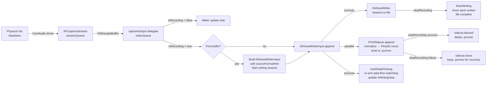

# DoublEnder — Theory of Operation

**Version:** 2.5.6lr · Last updated: 2026-09-26

---

## Table of Contents

1. [Product Overview](#1-product-overview)
2. [Architecture Overview](#2-architecture-overview)
3. [Audio Capture Pipeline](#3-audio-capture-pipeline)
4. [The State Machine](#4-the-state-machine)
5. [Robustness Architecture](#5-robustness-architecture)
6. [Device Management and Hot-Plug](#6-device-management-and-hot-plug)
7. [Crash Recovery in Detail](#7-crash-recovery-in-detail)
8. [Cloud Variant — What's Added](#8-cloud-variant--whats-added)
9. [App Lifecycle and Release Model](#9-app-lifecycle-and-release-model)
10. [Known Constraints and Design Decisions](#10-known-constraints-and-design-decisions)

---

## 1. Product Overview

### What the name means

A "double-ender" is a standard remote podcast recording technique. The host and guest each record their own microphone locally, then a producer combines the two independent recordings in post. This eliminates the compression artifacts and latency of a live stream capture and gives the editor full-quality stems from both sides. DoublEnder is the guest's end of that equation — the host typically uses professional DAW software; the guest needs something that can't be misconfigured.

### Who it's for and what problem it solves

DoublEnder is for podcast guests who should not need to know anything about audio. The problem is that most recording software is either consumer-grade and unpredictable (built for voice notes, with compressed defaults, and quiet about what survives a crash mid-take) or professional and intimidating. DoublEnder occupies the gap: it produces production-usable files, survives crashes and device disconnects, and presents little more than a microphone picker and a single button.

The design philosophy is deliberately Voice Memos-like in UX simplicity and field-recorder-like in reliability. It is closer to a hardware recorder (Zoom H6, Sound Devices MixPre) than to a consumer screen recorder: it records continuously to a safe format, mirrors a crash-recovery copy in parallel, and never silently loses a take.

### The two variants

Both build from the one `DoublEnder/` source tree. They differ in what is compiled in — the Local target leaves out the four Cloud-only source files, which exist only in the private overlay, and the Cloud target leaves out `ContentView.swift` in favour of `CloudContentView` — and in what assets and credentials are bundled.

| Variant | Version suffix | Key addition | Distribution |
|---|---|---|---|
| **DoublEnder Local** | `lr` | — | GitHub releases + GCS permalink |
| **DoublEnder Cloud** | `cr` | GCS resumable upload (Uploader, CloudConnectivity, CloudContentView, `GCS_ENABLED` flag), session heartbeat (SessionHeartbeat), pre-recording name prompt (`REQUIRE_RECORDING_NAME_AT_START`), a runtime switch that turns all of the above off for a session (§8), and Cloud-only art in `CloudAssets.xcassets` — the blue LED pair and the `CLOUD` label overlay (§2) | GCS (private) |

The `GCS_ENABLED` Swift compilation condition gates every Cloud-only code path. Every `#if GCS_ENABLED` block in the shared source tree compiles to nothing in Local builds, so the service-account key and upload logic are never shipped in the public app.

---

## 2. Architecture Overview

### Component map

```
┌─────────────────────────────────────────────────────────────┐
│                     DoublEnderApp (AppDelegate)              │
│  recorder window · quit intercept · crash recovery scan     │
└───────────────────────────┬─────────────────────────────────┘
                            │ @NSApplicationDelegateAdaptor
                            ▼
┌─────────────────────────────────────────────────────────────┐
│                    RecorderViewModel (shared singleton)      │
│  AppState · timers · disk watch · device selection logic    │
│  isFinalizingRecording · USB first-seen map                 │
└──────────┬──────────────────────────────┬───────────────────┘
           │ owns · Combine sinks          │ @ObservedObject
           ▼                              ▼
┌──────────────────┐              ┌────────────────────────────┐
│   AudioEngine    │              │   ContentView /            │
│                  │              │   CloudContentView         │
│  AVCaptureSession│              │                            │
│  AVAssetWriter   │              │  FaceplateDesign system    │
│  PCMSidecar      │              │  NSPopover-based settings  │
│  Watchdogs       │              │  RecorderMainPanel         │
└──────────────────┘              └────────────────────────────┘
```

### Layer responsibilities

**AppDelegate** owns what SwiftUI's scenes can't: the recorder window itself (`FaceplateWindow`, borderless yet able to become key, on screen before SwiftUI's launch pass; see §10), the quit intercept (`applicationShouldTerminate`, which ⌘W reaches too), and the crash-recovery scan, which hides the recorder until every recovered take is dealt with.

**RecorderViewModel** is the single source of truth. It holds `AppState`, the take's timers (elapsed time, the disk watch and the input-health poll; the watchdogs live in AudioEngine), the `selectedInputDeviceID`, and user preferences. It mediates between AppDelegate's event-driven callbacks (quit, crash-recovery) and AudioEngine's completion handlers. It is a singleton (`shared`) because AppDelegate needs access independently of SwiftUI's view hierarchy.

**AudioEngine** owns all AVFoundation objects. It knows nothing about SwiftUI or app state — it publishes `@Published` flags and fires callbacks that the VM handles. This isolation means the engine can be rebuilt, stopped, or torn down without touching the UI layer.

**PCMSidecar** is a pure I/O object. It writes a flat raw-PCM crash-recovery file alongside the main output. It has no dependencies on AudioEngine or the VM — AudioEngine calls it from the writer delegate queue.

**The faceplate** is a layered SwiftUI stack: a `ZStack` with the screen surface behind, interactive content (RecorderMainPanel) in the middle, then the faceplate PNG as a non-interactive decoration, then (on Cloud) a transparent label overlay, a screen glow, and finally the LED images. Beneath all of it is `WindowDragArea`, which moves the window when the faceplate is dragged (see "Moving the window" in §10). The window is `[.borderless]` with a transparent background — the faceplate image provides the visual frame. Settings and device-picker popovers are standard `NSPopover`s that float outside the borderless window.

**One plate, variant overlays.** `de_faceplate` lives in `SharedAssets.xcassets` and is rendered by *both* variants. It carries the brushed metal, the bezel, the DoublEnder wordmark, and the engraved `RECORDING` label. The only variant-specific art is the Cloud build's engraved `CLOUD` label:

| Overlay | Catalog | Appears in |
|---|---|---|
| `de_cloud_label` (engraved `CLOUD` label) | `CloudAssets.xcassets` | Cloud only |

Overlays are **authored** full-canvas, on the plate's own 5480 × 4680 canvas, so they register with it exactly and no position has to be measured by hand. They are **shipped cropped**: an overlay is decoded at full resolution however little of it is ink, costing roughly 98 MB of resident memory each — measured by removing one layer and watching the app drop from 350 MB to 242 MB. `tools/crop-overlay.py` crops an export to its ink and emits the frame and centre that put it back in the same place, in base-design points so it still scales. Re-run the tool when the art changes rather than hand-editing the constants.

The Cloud target excludes `Assets.xcassets` and adds `CloudAssets.xcassets`, so variant-specific art resolves per build with no conditional in the view. The alternative — a complete plate per variant — was rejected because the viewport cutout must line up exactly with the hardcoded `vpTop/vpLeading/vpTrailing/vpBottom` insets; a single shared plate makes that alignment identical by construction, where two plates could drift a few pixels apart in one variant only.

**The LEDs are not in the art.** Each LED asset supplies its own recessed socket and ring, and is composited over the plate; the plate has no holes drawn in it. Their coordinates are derived, not hardcoded: the column is right-aligned to the screen bezel's measured outer edge (`bezelRightEdge`), and each light is vertically centred on the engraved label it belongs to. Both LEDs are solid — see §8.

**One scale factor.** All faceplate geometry and type derive from `FaceplateDesign.scale` through `FaceplateDesign.s(_:)`. The base 1.0 design is a 504 × 430 window; the shipped scale is 1.2, so the real window is 604.8 × 516. Resizing the whole UI is that one constant — the plate art is 5480 px wide, roughly 9× oversampled even at 1.2, so no scale change needs new assets. `ledSize` scales with it deliberately: the engraved labels are baked into the plate and grow with it, and what matters is the light's proportion to the word it labels.

### Why this architecture vs. alternatives

**AVCaptureSession over AVAudioEngine:** AVAudioEngine uses an installTap approach that delivers samples through AVAudioPCMBuffer intermediates and requires explicit format negotiation. The old AUHAL-based path (used up to 1.6.26; AVCaptureSession replaced it in 1.6.27) had a race condition: when a USB device was selected, AUHAL's `kAudioUnitProperty_CurrentDevice` setter needed the device's hardware stream description to already be available, but fresh USB devices sometimes hadn't committed it yet, causing silent capture failures or click artifacts regardless of retry delay. AVCaptureSession binds the device directly (not via the system default), and delivering buffers in the device's native format through `AVCaptureAudioDataOutput` eliminates both the format negotiation and the AUHAL race. The capture-stage format conversion that produced click artifacts in every earlier attempt is simply not present.

**AVAssetWriter over AudioFile / ExtAudioFile / custom PCM writer:** AVAssetWriter writes the audio into the output file as it records — there is no temp file and no move on stop. It handles AAC encoding internally, writes the moov atom for M4A at `finishWriting`, and applies any necessary sample-rate conversion (for AAC only; WAV is written at native rate). It is a system framework with failure surfaces (writer status, write errors) that are explicit and catchable.

**Observable pattern:** RecorderViewModel conforms to `ObservableObject` with explicit `@Published` properties rather than using the newer `@Observable` macro. That is a requirement, not a preference: the deployment target is macOS 13, and the Observation framework behind `@Observable` needs macOS 14. `@ObservedObject` on the view side, and `objectWillChange.send()` from Combine sinks that forward AudioEngine's `@Published` flags, cover everything; AppDelegate simply reads the shared instance.

---

## 3. Audio Capture Pipeline

### End-to-end data flow


```mermaid
graph LR
    A[Physical mic\nHardware] -->|CoreAudio driver| B[AVCaptureSession\nsessionQueue]
    B -->|CMSampleBuffer| C[captureOutput delegate\nwriterQueue]
    C -->|isRecording = false| D[Meter update only]
    C -->|isRecording = true| E{First buffer?}
    E -->|yes| F[Build AVAssetWriterInput\nwith sourceFormatHint\nStart writing session]
    E -->|no| G[AVAssetWriterInput.append]
    F --> G
    G -->|success| H[AVAssetWriter\nstreams to file]
    G -->|parallel| I[PCMSidecar.append\nnormalize → Float32 mono\nwrite to .pcmrec]
    G -->|success| J[markDataFlowing\nre-arm data-flow watchdog\nupdate isWritingData]
    H -->|stopRecording| K[finishWriting\nmoov atom written\nfile complete]
    I -->|stopRecording success| L[sidecar.discard\ndelete .pcmrec]
    I -->|stopRecording failure| M[sidecar.close\nkeep .pcmrec for recovery]
```

### Two serial queues

**`sessionQueue` (`.userInitiated`):** All `AVCaptureSession` configuration and control runs here. `startRunning()` is a blocking call; Apple recommends it and all `beginConfiguration/commitConfiguration/stopRunning` calls be on a dedicated serial non-main queue. Every `rebuildSession` invocation dispatches its entire body to this queue and hops results back to the main actor.

**`writerQueue` (`.userInitiated`):** Set as the `setSampleBufferDelegate(_, queue:)` argument. Every `CMSampleBuffer` delivery lands here in serial order — the delegate and `AVAssetWriterInput.append` run synchronously on this queue. `PCMSidecar.append` is *invoked* from the delegate on `writerQueue`, but the sidecar's disk writes are dispatched to a separate `ioQueue` (see §3 sidecar) so capture is never blocked on sidecar I/O. `stopRecording` drains `writerQueue` with `writerQueue.sync {}` before taking the writer lock, guaranteeing any in-flight delegate call completes before writer refs are cleared; `sidecar.close()` / `sidecar.discard()` then `ioQueue.sync {}` to flush pending sidecar writes.

`writerLock` (an `NSLock`) mediates shared state between main-thread callers (`startRecording`, `stopRecording`, `cancelRecording`) and the delegate (which arrives on `writerQueue`). The lock scope is kept as narrow as possible: only the operations that read or write `assetWriter`, `assetWriterInput`, `pcmSidecar`, `pendingOutputSettings`, `pendingFileURL`, and the error/drop counters.

### Why AVCaptureAudioDataOutput has no `audioSettings`

The `AVCaptureAudioDataOutput` is created with default `audioSettings` (nil), so the session delivers CMSampleBuffers in whatever native format the device produces — linear PCM at the device's own bit depth, sample rate and channel layout (24-bit integer from many USB interfaces, 32-bit float from others). This is intentional.

Every prior attempt to set explicit `audioSettings` (specifying a target format like `AVLinearPCMBitDepthKey: 16`) produced click artifacts at format conversion boundaries — most noticeably at USB device attach/detach and on macOS CoreAudio reconfiguration events. The AVAssetWriter's internal transcoder handles format adaptation far more reliably when it sees the source format hint at writer-input creation time. No per-buffer PCM conversion happens anywhere in the hot path.

### The lazy AVAssetWriterInput

`startRecording()` creates the `AVAssetWriter` and stores the output settings (`pendingOutputSettings`) but does **not** create an `AVAssetWriterInput`. That happens in `captureOutput(_:didOutput:from:)` on the very first CMSampleBuffer.

The reason is `sourceFormatHint`. The `AVAssetWriterInput` initializer accepts a `CMFormatDescription` that describes the source PCM it will receive, and taking it from the first buffer's actual format description means the writer is configured, when the input is created, for exactly what the device delivers. The hint is not strictly required: in a test on macOS 26.7 with the app's settings, an input created without one accepted the same Int24 buffers and wrote a correct file, for both AAC and WAV. It is used because it states the real source format rather than leaving the writer to learn it from the first append. The first buffer's `CMSampleBufferGetPresentationTimeStamp` also becomes `writer.startSession(atSourceTime:)`, giving exact CoreMedia timestamps rather than synthesised ones.

### Format resolution: AAC vs. WAV

**AAC:** `AVFormatIDKey: kAudioFormatMPEG4AAC`, `AVSampleRateKey: 48_000`, `AVNumberOfChannelsKey: 1`, `AVEncoderBitRateKey: 256_000`. These are final — the writer downmixes multi-channel input and resamples to 48 kHz internally. Fixed rate is intentional: AAC is a delivery format for podcast production and 48 kHz is the broadcast-standard sample rate for voice.

**WAV (LPCM):** `AVFormatIDKey: kAudioFormatLinearPCM`, `AVLinearPCMBitDepthKey: 24`, little-endian, interleaved. `AVSampleRateKey: 48_000` is written into `pendingOutputSettings` as a **placeholder**, and 48 kHz is never actually used for WAV output. (The writer doesn't need it: on macOS 26.7 it accepted LPCM settings without a sample rate. The placeholder is harmless, and the explicit rate below is what counts.)

In the first-buffer delegate path, when the pending format ID is `kAudioFormatLinearPCM`, the code replaces the placeholder with the device's actual sample rate extracted from the buffer's `CMFormatDescription`:

```swift
var resolvedSettings = outputSettings
if let formatID = outputSettings[AVFormatIDKey] as? UInt32,
   formatID == kAudioFormatLinearPCM,
   let actualRate = sidecarRateUpdate {
    resolvedSettings[AVSampleRateKey] = actualRate
}
```

The `AVAssetWriterInput` is then created with `resolvedSettings` — so a device running at 48 kHz gets a 48 kHz WAV, one at 96 kHz a 96 kHz WAV, and the writer does not resample. This matters for production: a DAW importing a native-rate file needs no sample-rate conversion at the mix stage.

### The PCM sidecar mirror

While `AVAssetWriterInput.append` streams to the M4A/WAV, `PCMSidecar.append(sampleBuffer:)` is called from the capture delegate on `writerQueue` and writes a parallel Float32 mono stream to a companion file (the main file's name plus `.pcmrec`, e.g. `DoublEnder_….m4a.pcmrec`). Normalization happens on `writerQueue`; the actual `FileHandle.write` runs on a dedicated `ioQueue` so a slow disk never blocks the writer append. Under disk pressure the sidecar can fall behind the main file, with the pending writes held in memory; nothing bounds the gap. A write that fails fires `onFirstWriteFailure` once — the main recording continues regardless. On stop, `sidecar.close()` / `sidecar.discard()` synchronizes `ioQueue` so all samples dispatched before the delegate returned are flushed before the handle closes.

The sidecar is opened in `startRecording()` before `isRecording` is set, using a provisional sample rate from the device's `activeFormat`. Even a crash before the first buffer arrives leaves a sidecar on disk with a valid header. The provisional rate is patched later via `updateSampleRateIfNeeded` on every buffer where the rate changed (a no-op in practice unless a CoreAudio rate-change event occurred mid-session).

The DEP2 sidecar header format (20 bytes):

| Offset | Size | Field |
|---|---|---|
| 0 | 4 | Magic: `"DEP2"` (ASCII) |
| 4 | 8 | Sample rate (Float64, little-endian bit pattern) |
| 12 | 4 | Channel count (UInt32, little-endian) |
| 16 | 4 | Payload format code (UInt32, little-endian; `1` = Float32) |

DEP1 (16-byte, `"DEP1"`) omits the format code field. The parser handles both for backward compatibility with sidecars written by builds before 1.6.33, when DEP2 arrived.

The sidecar flushes to disk via `FileHandle.synchronize()` every 512 KB of payload. At 48 kHz Float32 mono (192 KB/s) this is approximately every 2.7 seconds; at 96 kHz it's roughly every 1.4 seconds. A power loss loses at most one sync interval rather than the entire session.

### Sidecar PCM normalization (Float32, Int16, Int24, Int32)

`PCMSidecar.normalizedMonoFloatSamples(from:)` reads the CMSampleBuffer's `AudioStreamBasicDescription` to determine format and bit depth, reads each channel through the buffer's `AudioBufferList` (so a planar channel is found wherever CoreMedia put it), decodes each sample to `Float`, and mixes the channels to mono as the writer mixes the main file (below). The four sample formats:

- **Float32** (`kAudioFormatFlagIsFloat` + 32 bits): used as is.
- **Int16** (`kAudioFormatFlagIsSignedInteger` + 16 bits): divide by `32768.0`.
- **Int24** (`kAudioFormatFlagIsSignedInteger` + 24 bits): 3 bytes per sample, little-endian on macOS. Read `b0, b1, b2` and sign-extend: `raw = (b2 << 16) | (b1 << 8) | b0`; if `raw & 0x800000 != 0`, set high byte to `0xFF`. Divide by `8388608.0` (2²³). This path covers interfaces that deliver 24-bit integer PCM.
- **Int32** (`kAudioFormatFlagIsSignedInteger` + 32 bits): reinterpret as `Int32`, divide by `Float(Int32.max)`.

Any other format (`mBitsPerChannel` not 16/24/32, or `mFormatFlags` not matching float or signed integer) returns nil and the sidecar gets no data for that buffer. The main writer still records normally.

### The mono mix

The output settings ask AVAssetWriter for one channel, and it makes the main file mono itself, with CoreAudio's downmix: each source channel is weighted by its label in the source format description's channel layout, and the results are summed. Measured on macOS 15 by writing each layout through the writer with the app's settings, and for an unlabelled pair on macOS 26.7 too:

| Source channels | Weight in the mono mix |
|---|---|
| One channel, whatever its label | 1 |
| A pair with no layout; Left, Right; tags Stereo, StereoHeadphones, Binaural | 0.707 each (−3 dB) |
| LeftSurround, RightSurround (tag Quadraphonic is L R Ls Rs) | 0.5 each |
| Center, Mono, Unknown | 1 each |
| Tag MidSide | mid 1, side 0 |
| Discrete channels (tag DiscreteInOrder, or Discrete_*n* labels) | Discrete_0 1, the rest 0 |
| Unused | 0 |

Discrete channels map to the writer's outputs by number, so with one output only the channel labelled Discrete_0 is heard: a mic on another input of such a device records nothing. `PCMSidecar.writerMixGains` returns those weights for a format description and `normalizedMonoFloatSamples` applies them, so the sidecar, and a WAV recovered from it, carry the file's mix. `PCMSidecarTests` writes every layout in the table through the writer on each CI run and requires the two to peak within 0.1 dB of each other, so a change in Apple's mix fails the build. A layout not in the table falls back: a pair mixes as left and right, and more channels as before this followed the writer (interleaved channels averaged, planar input's channel 0), which can differ from the file.

The meter in the UI reads from `PCMSidecar.normalizedMonoFloatSamples` too, so it shows the level the file records. Up to 2.5.6 every multi-channel source was averaged (interleaved) or reduced to channel 0 (planar), so for an ordinary two-channel source the meter read 3 dB under the file: a mic duplicated on both channels at −0.92 dBFS showed −0.92 on the meter while clipping the WAV at full scale and taking the AAC to +2.1 dBFS. The meter now reaches full scale when the file does. See "Mono output" in §10.

---

## 4. The State Machine

### States

```
AppState (RecorderViewModel.state):
  .selectingMic       — waiting for the microphone permission request to return
  .ready              — permission granted and an input chosen; the session may
                        still be building, and RECORD stays disabled until
                        canStartRecording (engine healthy, pick usable, not rebuilding)
  .recording          — take in progress
  .uploading          — (GCS only) writer done, upload running
  .uploadFailed(URL)  — (GCS only) retries exhausted; file still on Desktop
  .error(String)      — fatal condition; reset() returns to .ready
```

### Normal lifecycle

"RECORD tap" and "STOP tap" below are shorthand for the single record/stop button, which is labelled **PRESS TO RECORD** when idle and **PRESS TO STOP** while recording. Both labels render at one shared size so the type never changes when the button toggles.

```
init()
  └─ .selectingMic
       └─ AVCaptureDevice.requestAccess granted
            └─ refreshDevices + start engine
                 └─ .ready
                      └─ RECORD tap
                           └─ DiskSpaceChecker.recordingBlockedReason == nil
                                └─ startRecording()
                                     └─ .recording
                                          └─ STOP tap
                                               └─ stopRecording()
                                                    ├─ .success(.some(url))
                                                    │     ├─ (Local) .ready + RecordingSavedConfirmation
                                                    │     └─ (Cloud) .uploading → performUpload()
                                                    │                     ├─ success → .ready + UploadConfirmation
                                                    │                     └─ retries exhausted → .uploadFailed(URL)
                                                    │
                                                    └─ .success(.none)   — no samples written
                                                          ├─ .error — typical: the first-buffer watchdog (§5)
                                                          │           fired and left a disconnect reason
                                                          └─ .ready — user stopped within the 5 s watchdog window
```

### Abnormal paths

**Device disconnect during recording:**
`audioEngine.onDisconnectedDuringRecording` fires on the main thread. RecorderViewModel sets `suppressIdleInputLossAlert`, stores `pendingDisconnectReason`, and calls `stopRecording`. The stop completes as normal — `finishWriting` is attempted — and the file is saved if possible. After the completion block, `presentDisconnectAlert` runs. `switchToFallbackInputAfterLoss` then rebuilds with the built-in mic.

If the main file writer was in an error state at disconnect time, `stopRecording` receives `.failure`; if a PCM sidecar holds audio, `recoverSidecarIfNeeded` re-wraps it to WAV and presents that as the saved file instead. In the Cloud build with upload on, the recovered WAV becomes the take and is uploaded like one that finalized (`.uploading`, `performUpload`), and the upload's confirmation is the one the user sees; up to 2.5.6 it was saved but never uploaded, and no dialog appeared unless a disk note forced one. What the user is told otherwise is decided by `RecorderViewModel.stopFailureMessage`. A sidecar that holds audio but could not be re-wrapped gets "your audio is safe", with a relaunch to recover it. When the writer was torn down before any sample reached it (`canAdd` or `startWriting` failed on the first buffer), the engine has already dropped it and the stop comes back as `.noActiveRecording`, with a sidecar holding only its header: the user is told no audio was captured, in the same words as the no-samples stop above. Anything else reports the error. Up to 2.5.6 the check was only that a sidecar existed, so the torn-down case said the audio was safe, and the next launch deleted the empty sidecar without a word.

**Session interruption (another app takes the mic):**
`AVCaptureSessionWasInterrupted` fires. No buffers arrive during an interruption, so the data-flow watchdog is cancelled and the interruption watchdog arms for 5 seconds in its place. Meanwhile `sessionInterrupted = true` is published, and the UI shows "Input interrupted — reconnecting…" without stopping the clock. If the session recovers (either `AVCaptureSessionInterruptionEnded` or a successful sample buffer arriving), the watchdog is cancelled and the take continues. When `AVCaptureSessionInterruptionEnded` arrives, the session is restarted if it stopped. If it is running again, a fresh 3-second data-flow deadline is armed, so a session that restarts but delivers nothing fails the take like any other stall; if it did not restart, the take fails at once. If 5 seconds pass without recovery, the watchdog fires `handleRecordingCaptureFailure` and the take is stopped and saved. Up to 2.5.6 the data-flow watchdog stayed armed through an interruption and failed the take 3 seconds after the last buffer, so the 5-second allowance never applied.

**Data-flow stall (driver silently stops delivering):**
The data-flow watchdog fires after 3 seconds with no successful `append`. This catches USB hub starvation, driver firmware hangs, and Bluetooth profile transitions that don't generate an `AVCaptureSessionWasInterrupted` notification. The path is identical to the interruption watchdog: `handleRecordingCaptureFailure` → `dispatchDisconnectIfNeeded` → `onDisconnectedDuringRecording` → VM stop.

**No first buffer after record start:**
The first-buffer watchdog fires 5 seconds after record start if not a single buffer has been appended (see §5, Watchdog 4). The route is identical to the other watchdogs — `handleRecordingCaptureFailure` → `dispatchDisconnectIfNeeded` → `onDisconnectedDuringRecording` → VM stop — but because nothing was written, the stop completes as `.success(.none)` and the VM surfaces `.error` with "The microphone delivered no audio. No audio was captured — try again with the built-in microphone." This is the *typical* way a no-samples take ends; a silent `.ready` exit happens only when the user taps STOP inside the 5-second window.

**1-second input health poll:**
`checkRecordingInputHealth()` is called from `inputWatchTimer` every second. It checks `device.isConnected` and the device's presence in `availableInputDevices`. This is a belt-and-suspenders catch for USB unplugs that CoreAudio's listener reports slowly. It uses `disconnectStopPending` to prevent double-firing with the listener path.

**Sustained backpressure (writer can't keep up):**
If `AVAssetWriterInput.isReadyForMoreMediaData` returns false for 3 consecutive buffers (tens of milliseconds of dropped audio, depending on the device's buffer size), `tearDownWriterLocked` is called. If the writer has already received at least one sample (`didAppendAtLeastOneSample = true`), writer refs are left intact for `stopRecording` to finalize rather than cancelling. The VM then gets the same `onDisconnectedDuringRecording` path, but the `finishWriting` call in `stopRecording` may still succeed and produce a partial-but-valid file.

**Disk full during recording:**
`diskWatchTimer` fires every 5 seconds, calling `DiskSpaceChecker.recordingBlockedReason`. If it returns a reason, the view model keeps it in `diskStopReason` and calls `stopRecording()` immediately. Because the writer is still active (not in an error state), `finishWriting` usually succeeds and the file is saved. The saved confirmation then carries one more line, "Recording stopped early." followed by the DiskSpaceChecker message, so the user learns why when the take is confirmed, in the same dialog. In the Cloud build with upload on, the take goes to `.uploading` and the line rides on the upload's confirmation instead, whether the upload succeeds or fails, and only once: a later retry doesn't repeat it. In local-only mode it behaves as Local. If the stop saves nothing, the disk message is the error; if the writer could not finish, the message leads the error, or rides on the confirmation of a take recovered from the sidecar. The reason is kept apart from `pendingDisconnectReason`, which would add the microphone advice and the disconnect alert. Up to 2.5.6 nothing mentioned the disk: the take was saved with the ordinary confirmation, and the message appeared only when the next RECORD was refused.

**Duplicate stop calls (race between disconnect, disk watcher, and user STOP):**
`RecorderViewModel.isFinalizingRecording` is set true at the top of `stopRecording` and cleared when the engine's completion fires (success or real failure). A second `stopRecording` call that arrives while `isFinalizingRecording` is already true — and gets back `RecordingError.noActiveRecording` from AudioEngine (because the writer refs were cleared by the first call) — is silently swallowed as a no-op. A real `.noActiveRecording` (no finalize in flight) still surfaces as an error.

**Crash/force-quit:**
`applicationWillTerminate` never fires. The PCM sidecar is left open on disk. At next launch, the crash-recovery scan finds it and presents the recovery dialog. See §7.

**Reset after error:**
`viewModel.reset()` is called from `FaceplateErrorView`'s "TRY AGAIN" button. It cancels all timers, abandons stale engine state (via `audioEngine.abandonStaleRecordingState()` if `isRecordingActive`), clears `lastError`, sets state to `.ready`, and calls `audioEngine.start()` to rebuild the capture session. The sidecar is closed but not deleted by `abandonStaleRecordingState` — it stays on disk for the next launch recovery scan.

---

## 5. Robustness Architecture

The design philosophy is closer to a hardware field recorder than a consumer screen recorder. A hardware Zoom H6 does not stop recording because the headphone was unplugged; it writes continuously to SD card and keeps going. DoublEnder applies the same principle: no recording is lost to a recoverable failure, and no failure is silent.

### The four watchdogs

#### Watchdog 1: Interruption watchdog (5 seconds)

**What it covers:** `AVCaptureSessionWasInterrupted` indicates the session has lost the input to something else — another app or the system taking the audio hardware. It is treated as recoverable: a brief interruption ends and the session resumes.

**Mechanism:** On `captureSessionWasInterrupted` during a take, cancel the data-flow watchdog (no buffers flow during an interruption, so it would otherwise fire 3 seconds after the last one) and arm a `DispatchWorkItem` for 5 seconds. If the session recovers — either via `captureSessionInterruptionEnded` or a successful sample buffer arriving (whichever is first) — cancel the watchdog. If 5 seconds pass without recovery, the take is treated as a hard failure.

**Cancellation points:** `captureSessionInterruptionEnded`, `markDataFlowing` (first successful buffer after interruption), all recording-stop and cancel paths. Its firing is guarded by `disconnectStopPending`, so it stands down if another path is already stopping the take.

**UI surface:** While the watchdog is running, `sessionInterrupted = true` is published. RecorderViewModel exposes this as `recordingWarning = "Input interrupted — reconnecting…"`, shown as a yellow badge in the viewport. The clock keeps running.

#### Watchdog 2: Data-flow watchdog (3 seconds, re-armed per buffer)

**What it covers:** "Session running but driver stopped delivering." This is distinct from an interruption — `AVCaptureSessionWasInterrupted` does not fire. Causes include USB hub power starvation (the device reports as connected but stops sending), driver firmware hangs, and certain Bluetooth profile transitions where the hardware silently switches to SCO mode without signalling the session.

**Mechanism:** `armDataFlowWatchdog` cancels the existing watchdog and creates a new `DispatchWorkItem` for 3 seconds. It runs on every call to `markDataFlowing` (which is called from the delegate whenever `input.append` returns true), and when an interruption ends with the session running again, so a restart that delivers nothing fails the take instead of recording silence. If 3 seconds pass without a successful append, the watchdog fires `handleRecordingCaptureFailure`. Because the watchdog is cancelled and re-armed on every successful buffer, it only fires when the data truly stops. An interruption cancels it when it begins, leaving the interruption watchdog's 5 seconds to govern until the session recovers.

**Interaction with interruption watchdog:** If both fire in close proximity (a device disconnect that coincides with an interruption notification), `disconnectStopPending` and `didDispatchDisconnect` latches prevent duplicate teardowns. See "The disconnect latch chain" below.

#### Watchdog 3: Input-health poll (1 second, RecorderViewModel)

**What it covers:** CoreAudio's device-list listener can lag behind a physical USB unplug. The poll reads the bound device's `AVCaptureDevice.isConnected` directly rather than waiting for the list to change.

**Mechanism:** `inputWatchTimer` fires every second. `AudioEngine.checkRecordingInputHealth()` reads `currentInput?.device.isConnected` and checks whether the device UID still appears in `availableInputDevices`. Either failure triggers `triggerRecordingInputDisconnect`, which sets `disconnectStopPending` and routes through `handleRecordingCaptureFailure`.

#### Watchdog 4: First-buffer watchdog (5 seconds, armed at record start)

**What it covers:** A device that enumerates, reports connected, and starts a session — but never delivers a single buffer (wedged driver, USB hub power starvation already present at record start). The data-flow watchdog cannot catch this: it is armed only from `markDataFlowing`, i.e. only after at least one successful append. Before this watchdog existed (added in 1.8.1), such a take "recorded" silence indefinitely with no failure surface.

**Mechanism:** Armed once in `startRecording` with a 5-second deadline (`firstBufferTimeoutSeconds`). If it fires with no sample appended, it sets `disconnectStopPending` and routes through `handleRecordingCaptureFailure` with reason "The microphone delivered no audio" — the same latch chain as the other watchdogs. Five seconds matches the interruption watchdog's hard-failure patience: the capture session is already running and feeding the level meter before RECORD is even tappable, so a healthy first buffer lands ~10–20 ms after `isRecording` flips; the slowest observed cold-USB bring-up is over 1 s but well under 5.

**Cancellation points:** the first successful append in `markDataFlowing`, and every recording-stop / cancel / teardown path (`stopRecording`, `cancelRecording`, `abandonStaleRecordingState`, `clearStaleRecordingSessionIfNeeded`, both `tearDownWriterLocked` branches).

**Deliberately NOT cancelled on `captureSessionInterruptionEnded`:** a take whose first buffer never arrived keeps this deadline whatever an interruption did — and a genuinely healthy restart cancels it via `markDataFlowing` within milliseconds anyway. Do not "fix" this by adding that cancellation point.

That guard covers only a take whose first buffer never arrived, since the first append cancels this watchdog. A restart later in the take is guarded by the data-flow watchdog, which `captureSessionInterruptionEnded` arms afresh once the session is running again. Up to 2.5.6 it only cancelled the data-flow watchdog, so a mid-take interruption that ended with the session running but silent was left with no watchdog at all; the 1-second input-health poll checks only that the device is connected.

### The drop threshold (3 drops → take failure)

`AVAssetWriterInput.isReadyForMoreMediaData` returning false is a backpressure signal — the writer's internal ring buffer is momentarily full. A single false is normal on startup or during a brief encoder stall. Three consecutive false values (≈30 ms at a 48 kHz, 10 ms buffer) means sustained loss — audio is being dropped, the take is already compromised, and failing sooner triggers sidecar recovery before more audio is lost.

On the first drop, `droppedFrameWarning = true` is published. RecorderViewModel surfaces this as "Dropped frames — check disk" — a non-fatal warning. After three drops, `tearDownWriterLocked` is called. If samples were already appended, the writer refs are left intact for `stopRecording` to finalize the partial take.

A separate counter (`consecutiveWriteErrors`) tracks failed `input.append()` calls, with the same threshold of 3. Both counters reset to zero on any successful append.

### The disconnect latch chain

Three separate latches prevent duplicate teardowns when several failure paths converge:

1. **`disconnectStopPending` (AudioEngine):** Every failure path checks that it is clear, sets it, and then calls `handleRecordingCaptureFailure`, which proceeds only when it is set: `triggerRecordingInputDisconnect` (device list and health poll), all three watchdogs, `captureSessionRuntimeError`, and an interruption that ends with the session still down. `tearDownWriterLocked` sets it too and dispatches directly. The first path to set it wins; the others find it set and stand down for the rest of the take. It is cleared by every stop path and at the next `startRecording`.

2. **`didDispatchDisconnect` (AudioEngine):** Set in `dispatchDisconnectIfNeeded`. Because multiple paths can all arrive at `handleRecordingCaptureFailure → dispatchDisconnectIfNeeded` (interruption watchdog, data-flow watchdog, runtime error, health poll), this latch guarantees `onDisconnectedDuringRecording` fires exactly once per take. Reset in `startRecording` for the next take.

3. **`isFinalizingRecording` (RecorderViewModel):** Set at the top of `stopRecording`, cleared in the engine completion block. When AudioEngine has already cleared its writer refs (first caller won), a second `stopRecording` arriving in the same window gets `RecordingError.noActiveRecording` back. With `isFinalizingRecording = true`, the VM swallows this as a no-op instead of surfacing a spurious "failed to finalize" error.

### The PCM sidecar as crash safety net

The sidecar parallel-writes the entire session as uncompressed Float32 mono PCM. Because it's a flat append-only file with a self-describing header, even an abruptly truncated sidecar (power loss mid-session) re-wraps into a valid WAV at recovery time — there is no moov atom, no container integrity requirement. The recovered WAV plays from the first sample.

On a normal successful stop, `sidecar.discard()` deletes the `.pcmrec` file — it's redundant once the main file is closed. When `finishWriting` fails, or the engine tears the writer down, `sidecar.close()` keeps the file for recovery; a crash or a kill simply leaves it where it is. The critical invariant: the sidecar file exists on disk if and only if the main recording is unrecoverable.

**Sidecar write failure (mid-take):** If any `FileHandle.write` fails (disk full, filesystem error), `onFirstWriteFailure` fires once and sets `audioEngine.sidecarFailedDuringRecording = true`. The main recording continues — the sidecar is the backup, not the primary. The VM surfaces "Crash backup unavailable" as a non-fatal warning. Subsequent write failures are silent (latch prevents re-notification).

### Quit protection flow

`applicationShouldTerminate` returns `.terminateLater` when `isCurrentlyRecording` is true. `presentRecordingInProgressAlert` shows a dark-themed modal (dark aqua appearance) with three choices:

- **Stop & Save:** Calls `vm.stopRecording { NSApp.reply(toApplicationShouldTerminate: true) }`. The app stays alive until `finishWriting` completes, then terminates normally.
- **Quit Without Saving:** Calls `vm.abortRecording { NSApp.reply(toApplicationShouldTerminate: true) }`. `AudioEngine.cancelRecording` calls `writer.cancelWriting()` (which deletes the partial output file) and `sidecar.discard()`.
- **Cancel:** Calls `NSApp.reply(toApplicationShouldTerminate: false)`. The recording, which never paused, continues.

**Uploading (Cloud):** `applicationShouldTerminate` also returns `.terminateLater` when `isCurrentlyUploading` is true — recording and uploading are mutually exclusive states, so at most one intercept presents. `presentUploadInProgressAlert` offers exactly two choices:

- **Keep Uploading** (default — pressing Return keeps the upload alive): replies `false`; the upload continues.
- **Quit Anyway:** termination proceeds immediately.

There is deliberately **no** "wait for the upload to finish" option, so a stalled upload can never hang quit. The recording is already safe on the Desktop, and the pending-upload record was persisted before initiation — quitting only defers the upload to the next-launch prompt, which resumes from the committed offset (§8).

### Disk space fail-closed

At record start: if `DiskSpaceChecker.recordingBlockedReason` returns a non-nil reason, the state is set to `.error(reason)` and recording does not start. Thresholds: 50 MB for AAC, 200 MB for WAV. If `volumeAvailableCapacityForImportantUsage` cannot be queried (unusual filesystem, permission error), the function returns a blocking message — it does not allow recording. Fail-closed means a recording cannot start on a volume the app can't measure.

During recording, the 5-second disk watch calls the same function. If it returns non-nil, `stopRecording()` is called immediately — the writer is still healthy at this point, so `finishWriting` usually succeeds and the file is saved — and the take's confirmation says the disk stopped it, with the same message (§4).

---

## 6. Device Management and Hot-Plug

### Device enumeration

`AudioEngine.refreshDevices()` calls `AVCaptureDevice.DiscoverySession(deviceTypes: [.microphone, .external], mediaType: .audio, position: .unspecified)` on macOS 14 and later, and the deprecated `AVCaptureDevice.devices(for: .audio)` on macOS 13, where those device types don't exist. It filters the result to remove `CADefaultDeviceAggregate-*` entries. These are macOS-internal aggregate devices CoreAudio auto-creates around the current system default for AUHAL compatibility; they mean nothing to the user and picking one is effectively a no-op (it re-points at whatever the real default is).

Hardware vs. virtual classification uses CoreAudio `kAudioDevicePropertyTransportType`. Devices with transport `kAudioDeviceTransportTypeAggregate` or `kAudioDeviceTransportTypeVirtual` are classified as `.virtual`; everything else, including a device whose transport CoreAudio can't report, is classified as `.microphone`, so real hardware is never hidden. The `hardwareInputDevices()` filter exposes only the `.microphone` class to the picker, so BlackHole, Loopback, and similar virtual routing devices never appear in the UI.

### Refresh triggers

`refreshDevices()` has three engine-side triggers:
1. **CoreAudio listener** (`kAudioHardwarePropertyDevices`, dispatched to main): fires the moment any device is added or removed from the system device list.
2. **`NSApplication.didBecomeActiveNotification`**: devices plugged while DoublEnder was backgrounded are picked up when the app comes front.
3. **`NSWorkspace.didWakeNotification`**: catches devices that reconnected during sleep.

The two notification triggers share `handleRefreshTrigger`, which skips the refresh while a take is in progress — a device change mid-recording is the disconnect machinery's concern (§5), not the picker's. RecorderViewModel additionally calls `refreshDevices()` directly at permission grant and in `switchToFallbackInputAfterLoss`. The listener and the notifications overlap on purpose, as belt-and-suspenders.

### Hot-plug offer

On each `refreshDevices`, new UIDs (UIDs present now but absent in `knownInputDeviceUIDs`) that are USB devices trigger `onNewUSBDeviceDetected` — but only while no take is in progress (`AudioEngine` skips the callback when `isRecording`; `RecorderViewModel.presentUSBSwitchPrompt` also bails on `isCurrentlyRecording`). The handler presents an `NSAlert` app-modal offering to switch. `knownInputDeviceUIDs` is updated **before** firing the callback, so any re-entrant `refreshDevices` call that arrives during the modal's `runModal()` loop sees the new UID as already known and does not stack a duplicate prompt. The first `refreshDevices` after init seeds `knownInputDeviceUIDs` silently — launch-time device population is not a "new arrival."

If the user dismisses with "Keep Current," the UID is stored in `dismissedUSBDevices` (memory-only, per-session). It will not be offered again until the next app launch. The same UID will be offered at the next launch if the device is still present (via the post-init USB prompt path in `requestPermissions`).

### USB first-seen map

`recordCurrentUSBDevicesFirstSeen()` stamps every currently-present USB device with a timestamp in `UserDefaults` (key `usbDeviceFirstSeenAt`, value `[UID: Double]`). Entries are never pruned — UIDs are stable per physical device, so the map grows only with new hardware. At launch, `mostRecentlyConnectedUSBDevice()` picks the USB device with the most recent timestamp and offers it via `presentUSBSwitchPrompt`. This captures "the one I just plugged in" intent when multiple USB devices are present.

### `setDevice` flow

`RecorderViewModel.selectedInputDeviceID.didSet` → `AudioEngine.setDevice(_:)`:
1. **Pre-check:** `deviceHasInputStreams` queries CoreAudio for input stream count. Zero → set `selectedDeviceUsable = false` and return (no session rebuild). The previously-bound device stays bound. (During a recording the view model reverts a pick before calling `setDevice`, which refuses anyway.) `deviceHasInputStreams` returns true on query failure rather than false-rejecting.
2. **System default:** `setSystemDefaultInputDevice` is called for cross-app consistency. Other apps that honor the system default will follow the pick. Note: some virtual devices accept this call with no error but CoreAudio ignores it silently. Nothing detects that, and nothing needs to: DoublEnder binds the device directly, so its own capture never depends on the system default.
3. **Session rebuild:** `rebuildSession(with: device, intendedDeviceID: id)` tears down the current session on `sessionQueue` and builds a new one bound to the explicit `AVCaptureDevice`. After `session.startRunning()`, the code resolves `intendedDeviceID` back to an `AVCaptureDevice` and compares UIDs; if they differ, `selectedDeviceUsable = false` is published. Because the session is built from that same device, this is a check that the session is on the requested input. It cannot see the system-default setting.

### Disconnect during recording vs. while idle

**Recording:** `notifyIfRecordingInputDisconnected` (from `refreshDevices`) or `checkRecordingInputHealth` (from the 1s timer) calls `triggerRecordingInputDisconnect` → `handleRecordingCaptureFailure` → `dispatchDisconnectIfNeeded` → `onDisconnectedDuringRecording`. The VM stops, saves, and switches to fallback.

**Idle:** `notifyIfActiveInputLostWhileIdle` detects that the bound device is gone and calls `onActiveInputLostWhileIdle`, once per loss (`idleInputLossNotified`). RecorderViewModel calls `switchToFallbackInputAfterLoss` and then presents the "switched to the built-in microphone" alert.

**Fallback device selection:** `switchToFallbackInputAfterLoss` calls `refreshDevices()` first to get the current list, then: built-in mic if present (`builtInInputDevice`), first hardware device otherwise (`preferredDefaultDevice`), or `audioEngine.start()` (engine with no device) if neither.

---

## 7. Crash Recovery in Detail

### The invariant

The sidecar file exists if and only if the main recording was never successfully finalized. The launch-time recovery scan relies on this to decide what to do.

### Launch-time scan

In `AppDelegate.applicationDidFinishLaunching` → `runCrashRecoveryIfNeeded`:

1. **Read the Desktop directory.** `FileManager.contentsOfDirectory(at: recordingsDirectory)`. If this throws (permission error, inaccessible Desktop), an alert shows `error.localizedDescription` and the function returns. This is the fail-closed scan behavior: an inaccessible Desktop is surfaced to the user rather than silently skipped.

2. **Filter for sidecars.** `pathExtension == "pcmrec"`.

3. **Discard empty sidecars.** `PCMSidecar.hasRecoverableContent` checks the file size against the 20-byte V2 header size. Sidecars that are header-only (a take that ended, by a crash or an engine tear-down, before any audio reached the sidecar; a failed `PCMSidecar.init` deletes its own file) are discarded. An engine tear-down of that kind has already told the user, when the take stopped, that no audio was captured (§4). Their companion main files are checked:
   - Main file `> PCMSidecar.mainFileValidThresholdBytes` (8 KB) → treated as a valid finalized recording; keep it, log a warning that the sidecar was orphaned. (Size alone can't establish that — see below.)
   - Main file `≤ PCMSidecar.mainFileValidThresholdBytes` → stub/aborted container; delete both.

4. **Recover non-empty sidecars.** The main window is hidden (`mainWindow?.orderOut(nil)`), `NSApp.activate(ignoringOtherApps: true)` brings DoublEnder forward, and each recoverable sidecar gets a `presentRecoveryDialog` call. The dialogs are sequential modals — the user must clear each before seeing the next. After all dialogs complete, `mainWindow?.makeKeyAndOrderFront(nil)` brings the app forward normally. In the Cloud build with upload on, a take recovered here is then offered for upload (§8, "Pending-upload recovery").

### The 8 KB threshold

`PCMSidecar.mainFileValidThresholdBytes` (8 KB) is the single source of truth for this check in launch-time cleanup and `RecoveryModel.hasValidMainFile`. It is meant to separate a finalized main file from a stub whose `finishWriting` never ran. Size cannot make that distinction. Measured on macOS 26.7 with the app's own writer settings:

| Main file | AAC (`.m4a`) | WAV |
|---|---|---|
| Finalized, 0.1 s take | 4,607 bytes | 18,496 bytes |
| Crashed (never finalized), 1 s take | 26,122 bytes | 148,096 bytes |
| Crashed, 10-minute take | 16.5 MB | 86.4 MB |
| After `cancelWriting()` | deleted | deleted |

AVAssetWriter writes the audio into the file as it records and adds the M4A's moov atom only at `finishWriting`, so a crashed M4A has all its audio but no index, and does not open. A crashed WAV has all its audio too, but its header records a data size of zero, so it reads as empty. Either way the file passes 8 KB within about a third of a second of recording, so exceeding the threshold means only that something was written, not that the file was finalized. `cancelWriting()` removes the file rather than leaving a stub.

The threshold is therefore used only where keeping the file is the safe side: launch cleanup, next to an empty sidecar, where a file over 8 KB holds the only audio there is. The recovery dialog asks a different question (below).

### RecoveryModel and RecoveryView

`RecoveryModel` is an `ObservableObject` that drives the recovery dialog through four phases:
- `.prompt` — one of two prompts depending on `hasValidMainFile`
- `.working` — spinner, running `PCMSidecar.recoverToWAV` on `DispatchQueue.global(qos: .userInitiated)`
- `.success(URL)` — the recovered WAV path
- `.failure(String)` — error message; the sidecar is left in place

`hasValidMainFile` is computed at init by `RecoveryModel.isFinishedRecording`: the companion main file (`.m4a` or `.wav`) must open with `AVAudioFile` and hold at least one frame. That is true of a finished take of any length and false of a crashed one — a crashed M4A has no moov atom and does not open, and a crashed WAV opens with no frames because its header records a data size of zero. It catches the race window where `finishWriting` completed but `sidecar.discard()` hadn't run before the crash — a valid recording on disk alongside a now-redundant sidecar. Up to 2.5.6 this check was the 8 KB threshold, which a crashed take passes within a third of a second, so almost every crash offered KEEP SAVED for a file that would not play, and keeping it deleted the sidecar, the only recoverable copy. `PCMSidecarTests` writes finished and unfinished takes in both formats with the app's own writer settings and checks both outcomes.

**Prompt options:**

When `hasValidMainFile = false` (interrupted recording — most common case):
- **RECOVER:** Run `PCMSidecar.recoverToWAV`. On success, delete both the sidecar and the companion (unplayable partial) main file, and offer REVEAL IN FINDER or CLOSE.
- **DELETE:** Delete both files without recovering. The audio is lost.

When `hasValidMainFile = true` (sidecar orphaned next to a valid main file):
- **KEEP SAVED:** Delete the sidecar, keep the main file. The already-finalized recording is preserved.
- **RECOVER:** Run recovery anyway (in case the user has reason to believe the saved file is bad).
- **DELETE:** Delete both files.

### Recovery WAV format

`PCMSidecar.recoverToWAV` reads the sidecar header for sample rate and channel count, writes a canonical 44-byte RIFF/WAVE header (`WAVE_FORMAT_IEEE_FLOAT`, 32-bit), and streams the sidecar payload in 1 MB chunks. The output is a valid IEEE float PCM WAV compatible with any DAW. Output path: `"{stem} (recovered).wav"` adjacent to the main output file, de-duplicated with " (recovered 2)", " (recovered 3)", etc.

---

## 8. Cloud Variant — What's Added

The `GCS_ENABLED` compilation condition gates all Cloud-only code. Everything in this section is compiled out of Local builds.

### The local-only switch (runtime)

Two independent gates govern the cloud features, and conflating them is a mistake with real consequences:

| Gate | Kind | What it controls |
|---|---|---|
| `GCS_ENABLED` | Compile-time | Whether cloud code and credentials exist in the binary at all. This is the security boundary. |
| `cloudUploadEnabled` | Runtime | Whether a Cloud build *uses* its cloud features this session. Purely behavioural. |

`RecorderViewModel.cloudUploadEnabled` is a single master switch, exposed in the settings popover, that turns off every cloud-side behaviour at once: the GCS upload, the session heartbeat, the pre-recording name prompt, and the launch-time pending-upload prompt. With it off, the Cloud build takes the same code path as Local — the take still records and saves to the Desktop with the same confirmation, it simply never leaves the machine. This exists so one install can serve both purposes instead of a user keeping two apps side by side.

**It is not a security boundary.** The bundled service-account key and ingest token ship in the Cloud build regardless of the setting. A Cloud build stays client-only and must never be distributed publicly no matter how the switch is set; only `GCS_ENABLED` keeps credentials out of an app.

**Always on at launch.** The setting is deliberately session-scoped and never persisted — every launch starts with cloud on, so disabling is a conscious act repeated each session. The failure it guards against is specific: a guest who switched uploading off once, and had that silently persist, would leave the producer with no file *and* no dashboard row, with nothing on screen to explain why. Uploading is the safe default, so the burden belongs on turning it off rather than on remembering to turn it back on. `eraseSessionDefaults()` also removes the key persisted by 2.1.0, so a stored "off" from that build is cleared and never honoured.

**Two visible indicators**, because a silently disabled upload is exactly the failure mode a producer cannot see:
- The cloud LED stays dark. On its own this is ambiguous — dark also means "unreachable" — so it is paired with:
- A `LOCAL` marker beside the version in the viewport's metadata strip, present for the whole session.

**Interaction with in-flight work.** The toggle is disabled while recording or uploading, so a mode change can never strand a take mid-flight. Turning it off calls `SessionHeartbeat.deactivate()` so the dashboard sees the instance go quiet (row ages to Stale, then TTL-clears) rather than keep receiving "idle", and clears a stranded `.uploadFailed` state. A persisted pending-upload record is deliberately **preserved**, not discarded: the launch prompt simply stays silent while cloud is off, and turning it back on still offers to finish that upload, resuming from the committed offset.

### GCS authentication — V4 signed URL, entirely on-device

DoublEnder Cloud has no backend server. Authentication uses GCS V4 signed URLs generated entirely on the client from a bundled GCP service-account JSON key. The approach:

1. Load the bundled service-account key (JSON) from the app bundle (via `Bundle.main.url(forResource:)`).
2. Parse `private_key` (PEM-encoded PKCS#8 RSA key) and `client_email`.
3. Build a canonical request string for the resumable-initiation POST according to the V4 signing protocol. The signed headers are `host;x-goog-hash;x-goog-resumable` — `x-goog-*` extension headers must be signed for GCS to accept the start request and remember the checksum for finalize-time validation.
4. SHA-256 hash it with CryptoKit, and build the V4 string-to-sign: the algorithm, the timestamp, the credential scope and that hash in hex.
5. Sign the string-to-sign with RSASSA-PKCS1-v1_5 over SHA-256 via `SecKeyCreateSignature` (`.rsaSignatureMessagePKCS1v15SHA256`; Security.framework, because CryptoKit has no RSA). The PKCS#8 outer `PrivateKeyInfo` wrapper is stripped via a minimal DER walk to extract the bare PKCS#1 `RSAPrivateKey` that `SecKeyCreateWithData` expects.
6. Hex-encode the signature and append to the canonical query string.

The signed URL is valid for 15 minutes — but it gates **only the initiation POST**. GCS answers that POST with a **session URI** which is itself the upload capability: every subsequent chunk PUT goes to it unsigned, and it stays valid for about a week. That split is the load-bearing fact of the design: a multi-gigabyte take on a slow connection can far outlive the 15-minute signing window, because the signature only has to survive the instant of initiation. No OAuth token, no refresh cycle, no backend round-trip.

### Upload flow

`RecorderViewModel.stopRecording` completion (`.success(.some(url))`) sets `state = .uploading` and hands off to `performUpload()`, which drives a **two-phase resumable upload** (replacing the pre-2.0 single-shot PUT). When the local-only switch is off, this branch is skipped entirely and the completion takes the Local path instead — saved, confirmed, never uploaded:

**Phase 1 — initiate (`Uploader.beginUpload`):** compute the file's CRC32C, then POST to the V4-signed initiation URL with `x-goog-resumable: start` and `x-goog-hash: crc32c=…`. GCS answers `201` with a `Location` header — the session URI that carries the rest of the transfer.

**Phase 2 — transfer (`Uploader.continueUpload`):** first query what GCS has already committed (`Content-Range: bytes */TOTAL` → `308` + `Range: bytes=0-N`; GCS is the source of truth for persisted bytes, so a resume re-queries rather than trusting a local counter), then stream the remaining bytes to the session URI in 16 MiB chunks with `Content-Range: bytes start-end/total`. Intermediate chunks return `308` with the committed offset; the final chunk returns `200/201` and finalizes the object. Progress is computed as chunk-base offset plus bytes sent from the `urlSession(_:task:didSendBodyData:...)` delegate, so `uploadProgress` stays monotonic across chunk boundaries and resumes.

**Integrity (strategy A + B):** the CRC32C sent at initiation makes GCS refuse a corrupt finalize server-side — a `400 CrcMismatch`/`BadDigest` response surfaces as a non-retryable integrity failure, independent of any client-side bug. The finalize response's `x-goog-hash` is *also* compared client-side against the locally computed CRC32C. Either failure keeps the local file and never counts as success.

**The pending record:** before initiation, `{path}` is persisted to `UserDefaults` so a crash before init still restarts the upload next launch. The moment initiation succeeds, the record is upgraded to `{path, sessionURI, crc32c}` — from then on any retry, relaunch, or quit-and-reopen **resumes from GCS's committed offset instead of restarting**. A legacy bare-path value written by a pre-2.0 build decodes as "no session" and restarts.

**Failure handling:** transient failures retry with exponential backoff [2s, 4s, 8s], staying in `.uploading` throughout — and each retry resumes, not restarts. Deterministic failures (integrity mismatch, missing/malformed credential, signing failure) are non-retryable and fail immediately without burning retries. After retries are exhausted: `state = .uploadFailed(fileURL)`, `UploadConfirmation.present(success: false)`. On success: `clearPendingUpload()`, `state = .ready`, `UploadConfirmation.present(success: true)`. The local file always stays on the Desktop — the cloud object is a copy, not a move.

**Upload diagnostics (FR-004):** failures are logged as sanitized summaries only — a fixed category label, the numeric HTTP status, the attempt number, and elapsed time. The signed URL, session URI, key material, response body, file path, and guest name are never logged. A 400/403 failure additionally logs a clock-skew hint (a Mac clock off by more than ~15 minutes breaks V4 signatures). This discipline is an invariant: any logging added to the upload path must preserve it.

The GCS object key is `{prefix}/{uuid}/{filename}`. The prefix is derived from the bundle ID tail: `io.github.sevmorris.DoublEnderCloud` → `DoublEnderCloud`. The UUID prevents filename collisions — two takes with the same filename (possible when `requiresRecordingNameAtStart` is active and a guest records twice) get distinct object keys.

### Pending-upload recovery

`runPendingUploadCheckIfNeeded` (in `applicationDidFinishLaunching`) reads the pending-upload record from `UserDefaults`. In local-only mode it returns immediately without prompting, leaving the record intact. If the file still exists on disk, `PendingUploadPrompt.present` shows a modal offering Upload or Skip. Upload → `vm.resumePendingUpload(fileURL:)` → `performUpload()` — when the record carries a session URI, this resumes from GCS's committed offset rather than restarting. Skip → `clearPendingUpload()`. If the file is gone (user deleted it between sessions), the record is cleared silently.

After it, `offerUploadOfRecoveredTake` offers a take the launch-time crash-recovery scan (§7) just recovered, with the same prompt ("A recording wasn't uploaded last session"): Upload → `vm.resumePendingUpload(fileURL:)`, which records the file as pending before the upload starts; Skip leaves the WAV on the Desktop. Only one upload runs at a time, so when an interrupted upload was resumed a moment earlier the recovered take is not offered and stays on the Desktop. Up to 2.5.6 a take recovered at launch was never offered for upload: its session crashed before the upload could start, and nothing started it afterwards.

### CloudConnectivity and the blue LED

`CloudConnectivity` (singleton, `@MainActor`) publishes a single `isReady` flag: `credentialsOK && networkSatisfied`.

- `credentialsOK`: checked once at init by parsing the service-account JSON for `private_key` and `client_email`. A bundle stripped of the key file (corrupted build) shows `isReady = false` forever.
- `networkSatisfied`: tracked live by `NWPathMonitor`, which reports each path change (Wi-Fi drop, VPN flip, airplane mode) as it happens. The monitor runs on a `.utility` background queue; updates hop to the main actor via `Task { @MainActor }` for the `@Published` mutation.

`CloudContentView` lights the blue LED only when the local-only switch is on *and* `connectivity.isReady` — see the switch's two indicators above. `ContentView` (Local) has no blue LED — the blue LED art lives in `CloudAssets.xcassets` and is not in the Local target, and `CloudConnectivity` is not imported. The red `RECORDING` LED is present in both variants (its art is in `SharedAssets.xcassets`) and is **solid** while `state == .recording`, dark otherwise.

Neither light blinks. The red LED did blink on a 0.75 s timer until 2.2.0; the blink existed to signal "something is happening" while the light was unlabelled, and once the plate carried an engraved `RECORDING` label beside it the label carried that meaning instead. Solid also matches field-recorder convention, where a blinking light means armed or paused and a solid one means rolling — and liveness is already evident from the incrementing counter and the moving meter. Removing it deleted the timer from both content views.

### Session heartbeat (dashboard)

`SessionHeartbeat` (singleton, compiled only into Cloud builds) lets a producer watch live sessions on a dashboard as Recording / Idle / Stale. While a take is in progress it POSTs `{sessionId, guestName, state, version}` to a Cloudflare Worker `/ingest` endpoint every 30 seconds; `sessionId` is a per-launch UUID, so each running Cloud instance is one dashboard row, and `version` is the build's own (`2.5.6cr`), so the dashboard shows which release each guest runs. A copy from before `version` was added sends no such field; the Worker then shows the build number from the request's default User-Agent (`DoublEnder%20Cloud/47 CFNetwork/…`).

The model is **pull-based staleness**: the app only ever beats its current state; the Worker derives "Stale" from the *absence* of beats and TTL-expires dead sessions. A crash therefore needs no "I died" message — the beats simply stop, and the dashboard reads Recording → Stale. A clean stop beats "idle" explicitly, reading Recording → Idle. That distinction — did the guest's app stop cleanly or die mid-take — is the whole point of the dashboard.

**Idle cap (2.0.1):** after a recording stops, idle beats continue for a bounded 5-minute window, then the timer stops itself and the app goes fully silent (no final "offline" beat; the Worker's TTL clears the row). The window preserves the clean-stop vs. crash signal for as long as it is meaningful — past it, "open but idle" and "closed" are indistinguishable anyway. The bound exists because the Workers KV free tier is ~1,000 writes/day and an unbounded 30-second idle beat from one left-open instance is ~3× that. A new recording re-arms the timer.

**Wiring:** `startRecording` calls `SessionHeartbeat.shared.recordingStarted(guestName:)`; every subsequent transition flows from a `$state` Combine sink, so any exit from `.recording` (stop, upload, error, disconnect, first-buffer failure) flips the beat to "idle" with no per-transition hook to keep in sync. Inert until the first `recordingStarted`, so the app doesn't beat while idle at launch — which is also how local-only mode silences it: the call is skipped, so the heartbeat simply never activates.

**Auth and configuration:** each POST carries a Cloudflare Access service token (`CF-Access-Client-Id` / `CF-Access-Client-Secret`), validated by Access at the edge. The ingest URL and both token halves come from three Info.plist keys injected at build time from a gitignored env file by the Cloud release pipeline — never literals in source. If any is absent or empty (dev builds without the injection, and — via the compile gate — every Local build), the heartbeat is fully inert. Sends are detached fire-and-forget URLSession tasks; a dead dashboard produces one log line and never blocks or delays recording. Logging follows the FR-004 discipline: HTTP status or error category only — never the secret, the URL, or the guest name.

### UpdateChecker — Cloud vs. Local

**Local:** Queries `https://api.github.com/repos/sevmorris/DoublEnder/releases/latest`. Compares `tag_name` (stripped of suffix and pre-release markers) against the installed version. "Download" opens the GCS permalink (`doublender-downloads/DoublEnder.dmg`) rather than a version-pinned GitHub asset — the permalink always resolves to the current build.

**Cloud:** Queries the `UpdateManifestURL` from the bundle's `Info.plist`. The manifest is a small JSON `{ "version": "X.Y.Zcr", "url": "https://…" }` written by the Cloud release pipeline (`release-cloud.sh`) on every release.

---

## 9. App Lifecycle and Release Model

### XcodeGen overlay pattern

The public repo contains `project.yml`, which builds the Local (`DoublEnder`) and `DoublEnderTests` targets. The private Cloud overlay (`project.cloud.yml`, gitignored) adds `DoublEnderCloud` and `DoublEnderCloudTests` targets and pulls in Cloud-only source paths and the service-account JSON.

Before any Cloud build, `release_cloud_merged_spec` runs a Ruby one-liner that merges the two YAMLs (`base["targets"].merge(cloud["targets"])`), writes a temporary `.project.merged.yml`, and runs `xcodegen generate`. The merged file is immediately deleted after `xcodegen` exits. The `.xcodeproj` in the repo is always generated from the public `project.yml` only; Cloud-specific project files are never committed.

### Version and build number conventions

```
MARKETING_VERSION: "X.Y.Zlr"     ← user-visible; in CFBundleShortVersionString
CURRENT_PROJECT_VERSION: "N"     ← build number; in CFBundleVersion
```

Version suffix conventions:
- `lr` — Local release
- `cr` — Cloud release

`VersionFormatting.numericVersion` strips the suffix for version comparisons: `"X.Y.Zlr"` → `"X.Y.Z"`. `splitSuffix` splits `"X.Y.Zlr"` → `("X.Y.Z", "lr")` for the on-screen version overlay, where the suffix is displayed in uppercase.

### `release.sh` pipeline

1. **Preflight:** check tools (xcodebuild, xcodegen, hdiutil, gh, git, codesign, xcrun, python3, gcloud), and that `python3` can import `dmgbuild` and also start a subprocess — a Python built against an SDK newer than the running macOS imports dmgbuild, then segfaults on its first subprocess, which is dmgbuild's call to `hdiutil`. Check that the notarytool keychain profile works (`xcrun notarytool history --keychain-profile notarytool`; `NOTARY_PROFILE` overrides the name), so a Mac without it finds out before the build rather than after; if the check fails while the screen is locked, it says so, because notarytool keeps its credentials in the data-protection keychain, which locks with the screen. Check that gcloud can reach the `gs://doublender-downloads` bucket (`gcloud storage buckets describe`): the permalink is written only after the GitHub release is public, and a signed-out gcloud failing there would leave every copy of the app told to update while its Download button still fetched the previous build. Then the repository: working tree clean; `git fetch --tags` from the tracked remote (the branch's upstream, else `origin`), since the remote's tags are the record and a clone that has not seen a release would otherwise pass (a local tag that disagrees with the remote fails the fetch); tag `vX.Y.Zlr` not already taken; and HEAD contains everything on the remote branch, because the push after the build is a fast-forward or nothing.
2. **Version ordering:** the new version must not sort below the highest `v*` tag. Publishing a lower version on top of a higher one would leave GitHub serving the older build as latest, and clients already on the newer version, comparing numerically, would read it as older and report themselves up to date. `ALLOW_DOWNGRADE=1` overrides.
3. **Shared files:** `scripts/check-shared.sh` compares every file whose header comment marks it as shared verbatim with the sibling app repos — `tools/dmg/dmg-settings.py`, `tools/dmg/make-background.py` and the script itself — with its copies in the sibling app repos checked out beside this one, and a content mismatch fails the release. A sibling that is not checked out is skipped, so a fresh clone passes.
4. **Release notes:** `release-notes/vX.Y.Zlr.md` must exist, unless `--generated-notes` is passed to release without one, so generated notes are a decision rather than a silent default. The notes are read only at the GitHub-release step, after the branch and tag are pushed, and failing there would strand a pushed tag with no release behind it; a missing file is caught here instead, while nothing has been committed, built or pushed. When the private Cloud overlay is present, the Cloud release that follows needs notes too: `DoublEnderCloud/release-notes/vX.Y.Zcr.md` in the overlay, at the same numeric version, holding what differs for Cloud and a pointer to the Local notes. Nothing publishes them, since a Cloud release is only a DMG and a version manifest, so they are the record of what each Cloud build changed; they're checked here because the Cloud step runs after this release is public. `--generated-notes` waives both.
5. **Version bump:** rewrite `MARKETING_VERSION` in `project.yml` unless it already matches. Then, always — so a `project.yml` bumped by hand can't leave the docs pointing at the previous release — rewrite the version line in `README.md` and in this document, the DMG filename in `README.md` and `docs/index.html`, and the Download label in `docs/index.html`, failing if a stale DMG filename survives. `xcodegen generate` regenerates `DoublEnder.xcodeproj`, and the changes, if any, are committed as `Bump version to X.Y.Zlr`.
6. **Build number bump:** increment `CURRENT_PROJECT_VERSION` in `project.yml`, regenerate the project, and commit `Bump build number to N`. Both bumps are committed before the build, so a failure at any later step leaves nothing uncommitted to revert; the commits stay local until the tag-and-push step.
7. **Build:** `xcodebuild -configuration Release -derivedDataPath /tmp/doublender_build_{version} -destination 'generic/platform=macOS'`. The `-destination` flag is **load-bearing**: without it xcodebuild auto-selects the first matching destination — `{platform:macOS, arch:arm64}` on an Apple Silicon Mac — and narrows the build to that single arch, silently overriding `ARCHS = "arm64 x86_64"`. That shipped an arm64-only binary for several releases while the README promised Intel support; an Intel Mac cannot launch such a build at all, because Rosetta translates x86_64 to arm64 and never the reverse. `generic` means "Any Mac" and produces the universal binary the build settings already ask for. Both release scripts assert `lipo -archs` contains arm64 **and** x86_64 after building, and fail the release if not.
8. **Codesign:** `codesign --force --options runtime --entitlements … --sign "Developer ID Application: Seven Morris (T9RLNAXPWU)"`, then `codesign --verify --deep --strict`.
9. **Verify version:** `defaults read {APP_PATH}/Contents/Info.plist CFBundleShortVersionString` must match.
10. **Notarize app:** zip the app with `ditto -c -k --keepParent`, submit the zip with `xcrun notarytool submit --wait --keychain-profile notarytool`, then run `xcrun stapler staple` and `xcrun stapler validate` on the app itself. Stapling only the DMG would leave the app unstapled once it is dragged out, which is the only form anyone runs, and Gatekeeper would then have to ask Apple on first launch, which needs a network. The ticket covers the app's exact cdhash, so this runs after codesigning and before the app goes into the DMG.
11. **Create DMG:** `dmgbuild -s tools/dmg/dmg-settings.py`, with the background art `tools/dmg/dmg-background-doublender.png`, builds `DoublEnder-vX.Y.Zlr.dmg`: a UDZO image with the volume name "Install DoublEnder" and its installer window laid out — background art with an arrow, the app and an `/Applications` symlink at either end of it, window chrome hidden. dmgbuild writes the `.DS_Store` directly, so a release needs no Finder, no GUI session and no automation permission. It runs under the `python3` that preflight checked, with `/bin` first on its `PATH` so its bare `sync` call can't be shadowed by a personal `~/bin/sync`. A missing background (regenerate it with `tools/dmg/make-background.py`) or a dmgbuild failure fails the release. There is deliberately no fallback to bare `hdiutil`: one added on 2026-09-16 shipped that day's DMGs without their installer window while still reporting a styled one, and a DMG without its window is a failed release, not a degraded one.
12. **Sign and notarize DMG:** `codesign --force --timestamp --sign …` the image itself, then `xcrun notarytool submit --wait --keychain-profile notarytool` + `xcrun stapler staple` on the DMG. An unsigned image reports "no usable signature" to `spctl` even with a valid ticket stapled, so Gatekeeper could never assess the download, however well notarized the app inside it; signing precedes submission, and stapling afterwards leaves the signature intact.
13. **Verify DMG:** mount it (`hdiutil attach -nobrowse`), read the version from the enclosed app, run `xcrun stapler validate` on that copy of the app — the one that ships, not the build product stapled earlier — and look for the `.DS_Store` and `.background.*` that make up the installer window, then unmount. A version mismatch, a missing ticket or a missing layout fails the release.
14. **Tag and push:** `git tag vX.Y.Zlr`, then a single `git push --atomic -u` of branch and tag to the remote resolved in preflight, so they land together or not at all; as two pushes, a refused tag left the release commit on the branch with nothing tagging it. If the push fails, nothing has been published: the local tag is deleted, so a re-run starts clean.
15. **GitHub release:** `gh release create` with the DMG as the release asset and `release-notes/vX.Y.Zlr.md` as the notes. Without that file — possible only under `--generated-notes` — the notes are generated from the subjects of commits since the previous `v*` tag, filtering out version-bump, build-bump and `docs:` commits.
16. **GCS permalink:** `gcloud storage cp` to `gs://doublender-downloads/DoublEnder.dmg` with `Cache-Control: public, max-age=60`, then re-assert public-read. The permalink always resolves to the latest build; the UpdateChecker's Download button uses this rather than a version-pinned GitHub URL. (Distinct from the Cloud *update manifest* `cloud-latest.json`, which is uploaded with `Cache-Control: no-cache` — update checks must read fresh; the 60-second cap on the DMG merely keeps a just-published build from being masked by an older cached copy.)
17. **Cloud release:** if `project.cloud.yml` is present, run `scripts/release-cloud-from-local.sh`. This publishes DoublEnder Cloud at the same numeric version.
18. **Prune old releases:** keep the 5 most recent GitHub releases tagged `v*`; delete the older release pages and their DMGs with `gh release delete`, but never their git tags. A release page is a convenience; a tag is the record, and without it a version can't be rebuilt from a clean clone.
19. **Prune old Pages deployments:** run `prune-deployments --keep 10` (mrk's `bin/`), which keeps the ten newest `github-pages` deployments and always the one serving the site, and marks the rest inactive and deletes them via the GitHub API, so the docs site's deployment list doesn't grow unboundedly. Keeping only the newest, as this step once did, deletes the live deployment whenever the one the release's push has just started is still building or has failed. The release is published by then, so a missing tool or a failed prune is reported rather than failing the run.
20. **Clean up:** remove temp build dirs and the DMG, then open the new release page. An `EXIT` trap does the same cleanup when the script stops early, detaching the verification mount first if a failure left it attached; `INT` and `TERM` are trapped too, since zsh does not run an `EXIT` trap on a signal, so Ctrl-C or a closed terminal during the long notarization wait gets the same cleanup.

---

## 10. Known Constraints and Design Decisions

### No sandbox

DoublEnder is unsandboxed. This is a deliberate choice: sandboxing would require either a security-scoped bookmark (complex, requires user interaction to establish) or a save panel to select the output directory. Both would add friction for guests who are asked to "just record and send the file." Unsandboxed, the app writes to the Desktop path (`FileManager.urls(for: .desktopDirectory)`) directly, with no bookmark or panel. macOS still guards the Desktop folder for every app, sandboxed or not (a Files and Folders privacy permission since macOS 10.15), so the first access, normally the launch-time crash-recovery scan, asks the user once. The prompt's explanation is the `NSDesktopFolderUsageDescription` key in Info.plist: "DoublEnder saves recordings to your Desktop and checks it for recordings left by a crash." Up to 2.5.6 the app supplied none, so the prompt gave no reason. `DoublEnder.entitlements` holds two entitlements: `com.apple.security.device.audio-input`, which the hardened runtime requires for microphone access, and `com.apple.security.network.client`, which only a sandboxed app needs. The microphone prompt's text is the `NSMicrophoneUsageDescription` key in Info.plist, not an entitlement. `ENABLE_HARDENED_RUNTIME: YES` is set, so the binary is notarization-eligible.

### No save panel

Files are written to `~/Desktop/DoublEnder_<timestamp>.<ext>` with no user interaction. The timestamp is formatted with `DateFormatter` in `en_US_POSIX` locale (prevents locale-specific AM/PM markers, RTL text, non-Gregorian calendar digits) at millisecond precision (format: `yyyy-MM-dd_HH-mm-ss-SSS`). Millisecond precision shrinks the same-timestamp collision window from 1 second to 1 millisecond; collisions still get `_2`, `_3`, … de-duplication.

The filename prefix is overridable from the settings popover (`filenameBase`), persisted to `UserDefaults` with key `filenameBase`. It is cleared at both `applicationWillTerminate` (clean quit) and `applicationWillFinishLaunching` (next launch, in case the previous session crashed before termination ran). This means the custom prefix is session-scoped: it persists only for the duration of an app session and resets on every launch.

### Mono output

All output is mono. The main file's mix is AVAssetWriter's own: the output settings ask for one channel and the writer downmixes whatever arrives, weighting each channel by its label (§3, "The mono mix"). For a two-channel source with no channel layout or a stereo one, it scales each channel by 0.707 (−3 dB) and sums them. A tone on one channel only lands 3 dB lower in the file, and the same signal on both channels lands 3 dB higher, so a device that duplicates a mono mic onto two channels clips the main file at any peak above −3 dBFS. A device whose channels are labelled discrete gives the file its first channel only. The sidecar and the meter apply the same weights, so the meter shows what the file records; only a channel layout the tests haven't measured can still differ. The rationale for mono: podcast production almost universally uses mono guest stems. Stereo doubles the file size for guests sharing via email or a consumer file service, and a podcast editor will sum to mono anyway. A future format option would not be hard to add, but it is not a current requirement.

### AAC as default format

256 kbps AAC over M4A is transparent quality for voice at a practical file size (~1.9 MB/min at its nominal rate). A 1-hour guest recording is ~115 MB — far above the 20–25 MB attachment limit of most email providers, so it travels by a file-sharing link, but a fraction of the ~520 MB the same hour takes as 24-bit WAV at 48 kHz. The encoder runs inside `AVAssetWriter`; for one mono voice channel its CPU cost is small.

WAV is provided for guests who are instructed specifically to record lossless (producers running a high-quality mix), but it defaults to off because naive guests will record 90-minute WAVs and then struggle to send them. The settings popover shows a format description that explains the tradeoff.

### Why the meter floor is −36 dB

`LevelMeter.dbFloor = -36`. The choice is deliberate: the meter is an activity indicator, not a precision metering tool. The 36 dB range from floor to 0 covers the range that matters for "is audio coming in?": speech at a sensible gain peaks in the top 12 dB or so. Extending the floor to −60 would add 24 dB that shows mostly room noise — lit segments at idle that say nothing useful about the voice. The 1 dB deadzone above `dbMin` in the meter rendering prevents the leftmost segment from staying lit at idle due to ambient noise resting just above the clamped floor.

### The main window is the app's, not SwiftUI's

The recorder window is a `FaceplateWindow`, an `NSWindow` subclass that `AppDelegate` builds and shows in `applicationWillFinishLaunching`, with the faceplate in an `NSHostingView`. SwiftUI keeps the Help window and the menus: the app's body is an empty `Settings` scene that carries the `.commands`, then the Help `Window`.

The window has to be borderless and still become key, so that a click from another app activates the recorder and the keyboard reaches it. SwiftUI can't provide that. Its window class, `SwiftUI.AppKitWindow`, answers false to `canBecomeKey` once the window is borderless, and so does the `.plain` window style added in macOS 15. In a `.plain` window a click makes a text field first responder but typing goes nowhere, and the window has no shadow. No SwiftUI API changes either. `FaceplateWindow` overrides `canBecomeKey` and `canBecomeMain`, as `RecoveryWindow` and `UploadConfirmationWindow` already do.

Up to 2.5.x the recorder was SwiftUI's `WindowGroup` window, made borderless in `applicationDidFinishLaunching` and then re-classed with `object_setClass` to an `NSWindow` subclass that could become key. This section called that safe. It wasn't. The window is a `SwiftUI.AppKitWindow`, not a stock `NSWindow`, and by `applicationDidFinishLaunching` it is already observed: its class is `NSKVONotifying_SwiftUI.AppKitWindow`, with observers from SwiftUI and from AppKit's views on `movableByWindowBackground`, `opaque`, `firstResponder`, `backgroundColor` and more. The swap dropped SwiftUI's overrides (`canBecomeKeyWindow`, `saveFrameUsingName:`, `constrainFrameRect:toScreen:` and `supplementalTargetForAction:sender:` among them) and the notifying setters. An observer registered before the swap heard nothing afterwards, and removing one threw `NSRangeException` ("Cannot remove an observer … because it is not registered as an observer"), the crash dbb549e hit when the swap ran first. The same code replaced SwiftUI's own window delegate, `SwiftUI.AppKitWindowController`, with `AppDelegate`. It also left three bugs. ⌘W did nothing, because AppKit disables File ▸ Close for a window with no close button. File ▸ New Window (⌘N) opened a second faceplate, titled and unconfigured. A Dock click while the recorder was hidden did the same.

Three details keep the app's own window working:

- **SwiftUI's launch pass.** At launch SwiftUI presents the app's first scene if no window is on screen by then. On macOS 26 that includes a `Settings` scene, which shows up as an empty Settings window. So `AppDelegate` puts the recorder on screen in `applicationWillFinishLaunching`: before that pass, and after `eraseSessionDefaults`, since the content view brings up the view model. A window created there but kept hidden doesn't count. The empty `Settings` scene comes first so that Help never is, and `CommandGroup(replacing: .appSettings)` removes its Settings… item. `applicationShouldHandleReopen` returns false, so a Dock click brings back the recorder rather than a SwiftUI scene.
- **⌘W.** With no `WindowGroup`, SwiftUI builds no File menu. `CommandGroup(replacing: .saveItem)` supplies Close (⌘W), which sends `performClose` to the key window. Help closes as usual. The recorder overrides `performClose`, since AppKit's version asks the delegate only when the window has a close button, so ⌘W reaches `windowShouldClose`. That calls `NSApp.terminate`, so ⌘W meets the same recording and upload checks as ⌘Q (§5).
- **Frame autosave.** The frame is saved as `NSWindow Frame Faceplate`. SwiftUI saved it under a name made from the root view's type, such as `DoublEnder.ContentView-1-AppWindow-1` or `DoublEnder_Cloud.CloudContentView-1-AppWindow-1`. `FaceplateWindow` reads that name once, when its own is missing, so the first launch after the update opens where the last one left off. Because the window can't be resized, only the position is taken from a saved frame, never the size. A drag moves the window with `setFrameOrigin`, which saves like any other move (see "Moving the window").

The window is `[.borderless]`, clear and non-opaque from `init`, so there is no title bar to strip and nothing to flash on first paint. The layer-clearing pass over `NSThemeFrame` that the old code needed goes with it: a borderless window's frame view is `NSNextStepFrame`, with nothing beside the hosting view. The test host (`TestHostApp`) has no app delegate, so a test run never builds the window.

### Moving the window

The faceplate moves its own window. `WindowDragArea`, the layer under the whole `ZStack`, carries a SwiftUI `DragGesture` that calls `setFrameOrigin` to keep the grabbed point under the pointer, reading the pointer from `NSEvent.mouseLocation` in screen coordinates, since the gesture's own translation collapses once the window follows the pointer. The faceplate art, the glow and the screen surface take no clicks, so a drag on the bezel or on the screen between the controls reaches it; the buttons sit above it and keep their clicks. `setFrameOrigin` posts `windowDidMove`, so the frame autosave keeps the position across launches. On macOS 15 and later the layer also accepts the click that activates the window, so a drag works on the first try from another app, as it does on a title bar. The themed dialogs (crash recovery, the save and upload confirmations, and the pending-upload prompt) carry the same layer between their content and their opaque fill, so each can be dragged by its empty area.

`isMovableByWindowBackground` is deliberately off. On macOS 27, AppKit no longer starts a background drag when the view under the click is SwiftUI's `NSHostingView`, which is all AppKit can see of the faceplate. Up to 2.5.5 the window relied on it, so on macOS 27 it could not be moved from where it first opened, the centre of the screen. Other apps hit the same change, and overriding `mouseDownCanMoveWindow` on the hosting view does not bring it back. Where AppKit's drag does still work, the flag is moot once the layer is in: on macOS 26, SwiftUI counts a view with a gesture as solid and leaves AppKit no background to drag. Switching it off leaves one mechanism on every macOS version, which means a drag tested on an older system exercises the same code a macOS 27 user runs.

### Notes metadata not stored in WAV

`AVMutableMetadataItem` with `.commonIdentifierDescription` is written to the `AVAssetWriter.metadata` array. M4A keeps it in the moov atom's metadata. `AVAssetWriter` writing to a WAV container silently drops it — there is no RIFF LIST INFO support in Apple's writer. (Both checked on macOS 26.7: the note's text is in a finished M4A and absent from a finished WAV.) The settings popover shows a warning ("Notes are not stored in WAV files.") when WAV is selected.

### The write-flow indicator

The `WRITING` label in the bottom-right of the viewport goes bright amber when buffers are actively flowing and dims when they stop. It does not track "is the capture session running" (the session's own `isRunning`, which AudioEngine keeps private) — it tracks "did `AVAssetWriterInput.append` return true in the last 150 ms." A capture session that is running but delivering no data (before the first real buffer after a device switch, during an interruption recovery window) correctly shows a dim WRITING label. This makes it a useful diagnostic: if the button is red-orange (recording state) but WRITING is dim for more than a second, something upstream is stalled.

### Session defaults (custom filename) cleared at every launch

`RecorderViewModel.eraseSessionDefaults()` is called from `applicationWillFinishLaunching`, which runs before the VM is initialized. This is earlier than `applicationWillTerminate` (which also clears it on clean quit) and critically runs even after a crash or force-quit where `applicationWillTerminate` never fires. The result: the custom filename prefix from a previous session cannot bleed into the next launch regardless of how the previous session ended.
